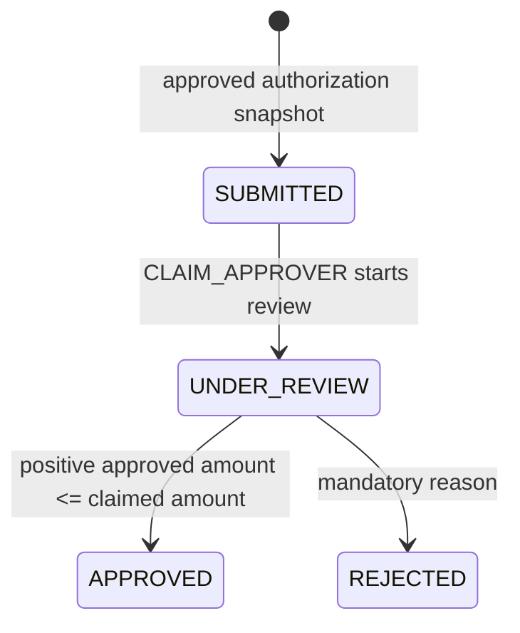
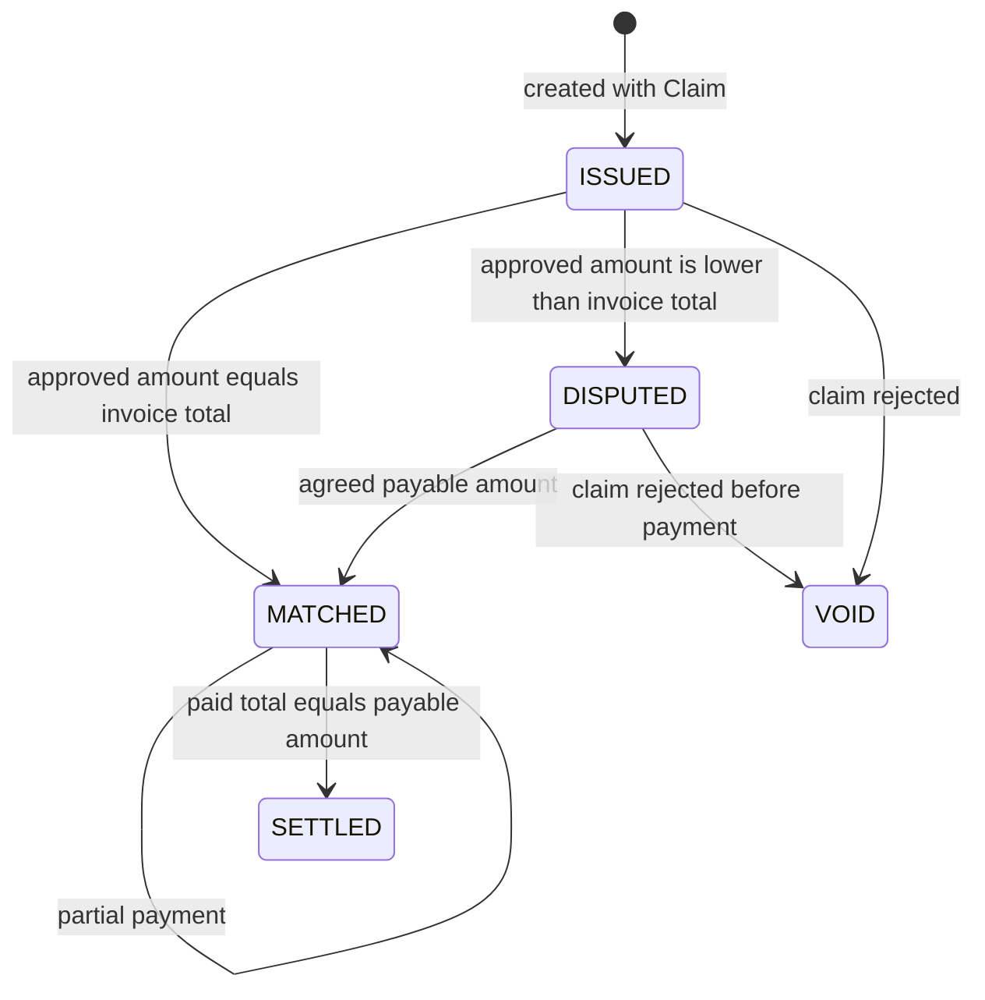
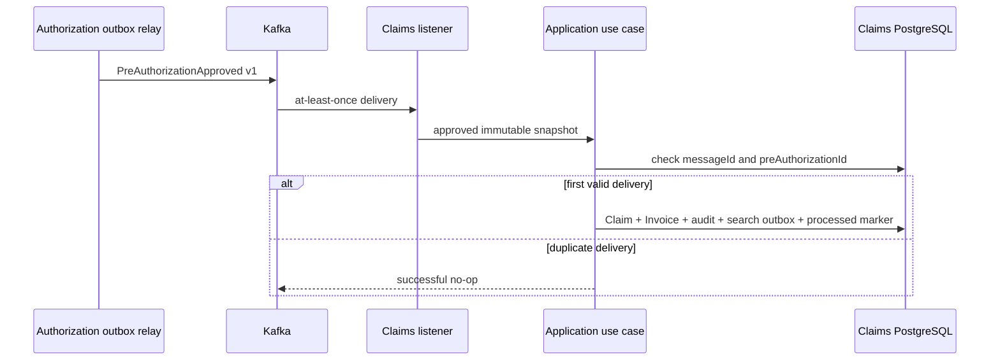

# Claims and Billing Service iş analizi

Bu doküman uygulanmış claim adjudication, invoice reconciliation, payment ve settlement workflow'larını açıklar. Mevcut behavior'ı kaydeder ve ek product scope önermez.

## Amaç ve sahiplik

Claims and Billing Service claims, invoices, payments, financial reconciliation, settlement state, processed Kafka message identity'leri, local audit evidence ve claim-search publication intent'in sahibidir. Policy veya Authorization database'lerini okumaz.

Authorization medical/coverage approval'ın sahibidir. Claims/Billing immutable approved snapshot alır ve yalnızca adjudication ile financial lifecycle data için authoritative hale gelir. Search derived read model olarak kalır.

## Aktörler ve capability'ler

| Aktör | Uygulanan capability |
| --- | --- |
| `HOSPITAL_USER` | Kendi approved pre-authorization'ından manual claim oluşturur; yalnızca provider-owned claim/invoice okur |
| `CLAIM_APPROVER` | Review başlatır, claim approve/reject eder; claims/invoices okur |
| `INSURANCE_SPECIALIST` | Invoice dispute çözer, payment kaydeder, claims/invoices okur |
| `SYSTEM_ADMIN` | Dispute çözer, payment kaydeder, minimized audit evidence sorgular, claims/invoices okur |
| Kafka approval consumer | Approved Authorization event'ten idempotent olarak tek Claim ve Invoice oluşturur |

Interactive hospital operation'larda provider ownership verified JWT'den gelir. Browser tarafından sağlanan provider identifier signed identity'yi override edemez.

## Ubiquitous language

| Terim | Anlam |
| --- | --- |
| Claim | Approved healthcare service ile ilişkili financial amount'un adjudicate edilmesi için request |
| Claimed amount | Adjudication için gönderilen amount; positive ve currency-bound |
| Approved amount | Claim approver tarafından kabul edilen amount; positive ve claimed amount'tan büyük değil |
| Invoice | Claim ile birlikte issue edilen provider financial record |
| Payable amount | Insurer'ın ödemeyi kabul ettiği reconciled amount |
| Dispute | Invoice total ile approved claim amount birbirinden farklı |
| Payment | Matched invoice'a karşı kaydedilen immutable reference, amount ve timestamp |
| Settlement | Payment toplamı payable amount'a tam olarak ulaşır |
| Processed message | Tek Kafka event identity için durable idempotency marker |

## Claim lifecycle

Direct submission-to-decision shortcut, reopening, cancellation veya arbitrary status update yoktur. İkinci veya out-of-order decision conflict'tir.

## Invoice lifecycle

Payment matched invoice, unique normalized payment reference, aynı currency ve payable amount'u aşmayan cumulative amount gerektirir. Settlement aggregate tarafından derive edilir; client bunu doğrudan set edemez.

## Event-driven creation

Yalnızca `APPROVED` event'leri financial record oluşturur. Unsupported version ve unreadable payload bounded policy ile retry edilir, sonra topic DLT'ye route edilir. Owner transaction oluşturulmuş claim'in invoice, audit evidence, projection intent veya idempotency marker olmadan kalmasını engeller.

## Adjudication ve reconciliation

| Claim decision | Invoice sonucu | Açıklama |
| --- | --- | --- |
| approved amount invoice total'a eşit | `MATCHED` | payment hemen başlayabilir |
| approved amount invoice total'dan düşük | `DISPUTED` | specialist/admin payable amount üzerinde anlaşmalıdır |
| claim rejected | `VOID` | unpaid issued/disputed invoice iptal edilir |

Claim approval ve invoice reconciliation tek application operation ve tek local transaction'dır. Bu distributed ACID değildir: Authorization approval daha önce gerçekleşmiştir ve Kafka bounded context'ler arasında eventual consistency sağlar.

## Failure ve consistency semantics

| Durum | Beklenen sonuç |
| --- | --- |
| Manual path'te unapproved/missing authorization | Fail-closed; claim oluşturulmaz |
| Authorization timeout, `5xx`, malformed/incomplete response, identifier mismatch veya invalid amount/status | `503`; claim oluşturulmaz |
| Synchronous manual path'te missing bearer token | `503`; anonymous service-to-service fallback yok |
| Hospital provider mismatch | `403`; disclosure veya mutation yok |
| Duplicate pre-authorization claim | Conflict; unique database rule yarışları korur |
| Legal state dışında decision | `409`; ilk committed state authoritative kalır |
| Claimed amount üzerinde approval veya currency mismatch | Validation failure; mutation yok |
| Match öncesi payment, duplicate reference veya overpayment | Reddedilir; invoice unchanged kalır |
| Duplicate Kafka event | Tek Claim/Invoice; sonraki delivery no-op |
| Invalid Kafka payload/version | Bounded retry ardından DLT |
| Search unavailable | Financial transaction recoverable projection outbox ile commit olur |

JPA optimistic version'ları concurrent aggregate write'ları korur. Database unique constraint'leri application pre-check altındaki yarışlarda pre-authorization, invoice-number ve payment-reference identity'lerini korur.

## Audit ve privacy boundary

Local append-only journal controlled aggregate type, action, status change, actor/role veya system-event origin, provider scope, correlation identifier ve timestamp kaydeder. Member, policy, service, monetary, payment-reference, token, request-body ve free-text rejection data'yı dışlar.

`SYSTEM_ADMIN` audit query'leri bounded ve service-local kalır. Bu, data ownership'i ihlal edecek shared audit database'i önler.

## Doğrulanmış checkpoint

Complete service suite şu anda 57 testten geçmektedir. Evidence aggregate rule'ları, use-case authorization, provider ownership, atomic state/audit/search outbox write'ları, JPA persistence ve optimistic locking, Kafka duplicate delivery ve DLT routing, REST contract'ları, Spring wiring ve ArchUnit boundary'lerini kapsar.

Focused live checkpoint gerçek synthetic Authorization event'i consume etti, tam bir Claim/Invoice çifti oluşturdu ve `UNDER_REVIEW -> APPROVED` ile `MATCHED -> SETTLED` akışlarını tamamladı. Repeated approval `409` döndürdü; owner database matching processed-message marker, altı minimized audit action, dört lifecycle search projection ve iki aggregate üzerinde optimistic version `2` içeriyordu.

Synchronous manual-creation adapter caller bearer token'ını relay eder ve complete Authorization snapshot'ını use case'e ulaşmadan validate eder. Missing token, transport/server failure, unreadable JSON, missing field, mismatched pre-authorization identity, unknown status, non-positive amount veya invalid currency durumlarını unavailable dependency olarak reddeder. Bu bilinçli olarak `503` ile fail-closed davranır; yalnızca well-formed `APPROVED` snapshot Claim oluşturabilir. Genuine Authorization `404` missing approval olarak kalır ve başka context storage'ını expose etmeden business conflict olarak ele alınır.

Rehydration yalnızca invalid new command'ları değil impossible Claim ve Invoice lifecycle combination'larını da reddeder. Liquibase changeset `005`, critical status, amount, currency, version, timestamp ve decision/reconciliation shape rule'larını 13 PostgreSQL check constraint ile tekrarlar. Spring Security filter failure'ları application error'ları ile aynı RFC 9457 `application/problem+json` contract'ını kullanır.

## Açık scope boundary'leri

- External payment provider veya banking settlement integration uygulanmamıştır.
- Approved coverage Policy Service tarafından reserve edilmez.
- Kafka normal path olsa da manual claim creation desteklenmeye devam eder.
- Search eventually consistent'tir ve payments için hiçbir zaman authoritative değildir.
- Bu portfolio-grade correctness evidence'dır; measured production throughput değildir.
- Backup, disaster recovery ve gerçek financial compliance certification scope dışındadır.

Bkz. [component architecture](../architecture/claims-billing-service.md) ve [local verification guide](../development/claims-billing-service-local-verification.md).
