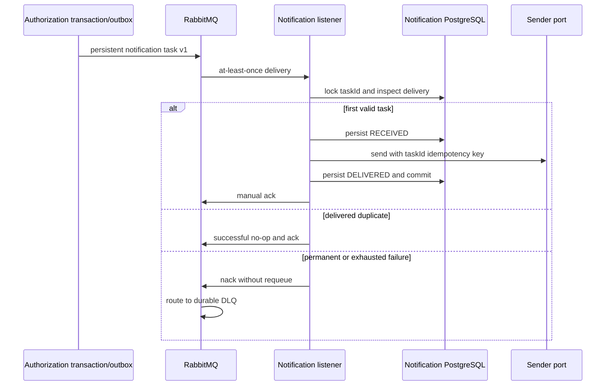

# Notification Worker business analysis

This document explains the implemented notification-delivery responsibility.
It records current behavior and does not add email, SMS, or contact-management
scope.

## Purpose and ownership

Authorization owns the approval decision and atomically records a notification
task in its outbox. RabbitMQ distributes that operational command. Notification
Worker owns only the delivery attempt and its idempotency evidence in a private
PostgreSQL database.

The worker does not own or persist patients, policies, claims, clinical data,
contact addresses, rendered messages, or credentials. A recipient is an opaque
provider UUID; a real provider adapter would resolve contact data behind a
separate security boundary.

## Implemented workflow

## Contract and business semantics

The versioned task contains technical identifiers, notification type, opaque
provider recipient, template key, and occurrence time. Version `1` supports
pre-authorization approval and rejection notifications. The task contains no
member, policy, diagnosis, email, phone, token, or free-text business payload.

`taskId` identifies one immutable delivery intent. Replaying the same intent is
a no-op after delivery. Reusing the identifier with a different causation,
business reference, type, recipient, or template is a conflict.

## Failure and consistency rules

| Situation | Implemented result |
| --- | --- |
| transient sender failure | at most three attempts with bounded exponential backoff |
| malformed or unsupported task | no retry; reject to DLQ |
| exhausted transient failure | reject to DLQ |
| identical replay | acknowledge without a second send |
| same task ID, different intent | permanent conflict and DLQ |
| two simultaneous same-task consumers | PostgreSQL transaction advisory lock serializes them before sender invocation |
| crash before broker acknowledgement | RabbitMQ may redeliver; persisted delivery suppresses another send |

The model is at-least-once, not exactly-once. A crash after an external provider
accepts a request but before the local transaction commits remains a standard
side-effect gap. A future real provider must honor `taskId` as its idempotency
key. This limitation is explicit rather than hidden behind an exactly-once
claim.

## Verified checkpoint

The Java 21 suite passes 24/24 tests. It uses real PostgreSQL 17 and RabbitMQ
4.1 Testcontainers for migration, persistence, duplicate delivery, DLQ, manual
acknowledgement, and concurrency evidence.

The live local checkpoint consumed a genuine pending Authorization task and
persisted one `DELIVERED` row. Republishing the same valid task kept exactly one
row. Publishing a synthetic version `99` task created no delivery row and put
one message in `health.notifications.delivery.v1.dlq`; the primary queue was
drained. No message body or credential was captured.

See the [architecture](../architecture/notification-worker.md),
[RabbitMQ ADR](../adr/008-rabbitmq-notification-task-delivery.md), and
[local verification guide](../development/notification-worker-local-verification.md).
