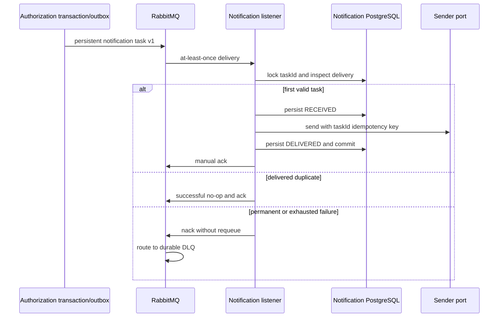

# Notification Worker iş analizi

Bu doküman uygulanmış notification-delivery sorumluluğunu açıklar. Mevcut behavior'ı kaydeder; email, SMS veya contact-management scope eklemez.

## Amaç ve sahiplik

Authorization approval decision'ın sahibidir ve notification task'ı kendi outbox'ına atomik olarak kaydeder. RabbitMQ bu operational command'ı dağıtır. Notification Worker yalnızca delivery attempt ve idempotency evidence'ın sahibidir; bunları private PostgreSQL database içinde tutar.

Worker patient, policy, claim, clinical data, contact address, rendered message veya credential sahibi değildir ve bunları persist etmez. Recipient opaque provider UUID'dir; gerçek provider adapter contact data'yı ayrı security boundary arkasında resolve eder.

## Uygulanan workflow

## Contract ve business semantics

Versioned task technical identifier'lar, notification type, opaque provider recipient, template key ve occurrence time içerir. Version `1`, pre-authorization approval ve rejection notification'larını destekler. Task member, policy, diagnosis, email, phone, token veya free-text business payload içermez.

`taskId` tek immutable delivery intent'i tanımlar. Aynı intent replay edilirse delivery sonrasında no-op olur. Identifier'ın farklı causation, business reference, type, recipient veya template ile reuse edilmesi conflict'tir.

## Failure ve consistency rule'ları

| Durum | Uygulanan sonuç |
| --- | --- |
| Transient sender failure | Bounded exponential backoff ile en fazla üç attempt |
| Malformed veya unsupported task | Retry yok; DLQ'ya reject |
| Exhausted transient failure | DLQ'ya reject |
| Identical replay | İkinci send olmadan acknowledge |
| Aynı task ID, farklı intent | Permanent conflict ve DLQ |
| Aynı task için iki simultaneous consumer | PostgreSQL transaction advisory lock sender invocation öncesinde serialize eder |
| Broker acknowledgement öncesi crash | RabbitMQ redelivery yapabilir; persisted delivery ikinci send'i suppress eder |

Model exactly-once değil at-least-once'dur. External provider request'i kabul ettikten sonra local transaction commit edilmeden crash oluşması standard side-effect gap olarak kalır. Future real provider `taskId` değerini idempotency key olarak uygulamalıdır. Bu limitation exactly-once iddiasının arkasına gizlenmeden açıkça belirtilir.

## Doğrulanmış checkpoint

Java 21 suite 24/24 testten geçer. Migration, persistence, duplicate delivery, DLQ, manual acknowledgement ve concurrency evidence için gerçek PostgreSQL 17 ve RabbitMQ 4.1 Testcontainers kullanır.

Live local checkpoint gerçek pending Authorization task'ını consume etti ve tek `DELIVERED` row persist etti. Aynı valid task yeniden publish edildiğinde yine yalnızca tek row kaldı. Synthetic version `99` task publish edildiğinde delivery row oluşmadı ve `health.notifications.delivery.v1.dlq` içinde tek message oluştu; primary queue drain edildi. Hiçbir message body veya credential capture edilmedi.

Bkz. [architecture](../architecture/notification-worker.md), [RabbitMQ ADR](../adr/008-rabbitmq-notification-task-delivery.md) ve [local verification guide](../development/notification-worker-local-verification.md).
