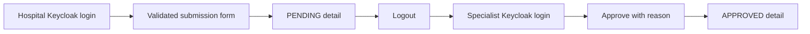

# Operations Portal iş analizi

Operations Portal role-aware operational client'tır. Policy, authorization, claim, invoice, notification, audit veya search data'nın sahibi değildir.

| Aktör | Uygulanan capability |
| --- | --- |
| `HOSPITAL_USER` | Provider-owned pre-authorization gönderir ve inceler |
| `INSURANCE_SPECIALIST` | Queue'ları inceler, request approve/reject eder ve provider'lar arasında search yapar |
| `CLAIM_APPROVER` | Claim-oriented operational discovery'ye erişir |
| `SYSTEM_ADMIN` | Bounded service-owned audit journal'larını sorgular |

Uygulanan screen'ler dashboard navigation, pre-authorization list/detail/submission/decision, healthcare search ve audit inspection'ı kapsar. Loading, empty, error ve forbidden state'ler explicit'tir. Filter ve pagination URL içinde tutulur; böylece operational search'ler reproduce edilebilir ve browser navigation yararlı kalır.

UI hidden button'ı hiçbir zaman authorization olarak görmez. Signed role'ler navigation ve interaction affordance'larını kontrol ederken her API call owner backend tarafından yeniden authorize edilir. Hospital provider scope signed `provider_id` değerinden gelir; browser state ile değiştirilemez.

Doğrulanmış workflow şöyledir:

Mevcut visual evidence primary workflow için screenshot `01`–`05`, cross-context search için `07` ve administrator audit access için `10` içinde kataloglanmıştır.

Live browser checkpoint ayrıca hospital user'ın audit route'u discover veya open edemediğini; `SYSTEM_ADMIN` kullanıcısının ise service-owned journal'ı yükleyebildiğini kanıtlar. Policy filter expected provider queue'yu döndürür, exact policy search indexed record'ları getirir ve unique query bilinçli empty state'i render eder.

Operational failure'lar ayırt edilebilir kalır: loading pending work'ü gösterir, empty result error sayılmaz, RFC 9457 detail'leri safe correlation reference'ı korur, retry explicit'tir, unauthorized session Keycloak'a döner ve unexpected render failure page'i data-free recovery screen ile değiştirir.

Authenticated work queue 390-pixel mobile width'te operable kalır: navigation erişilebilir, filter'lar tek kolona düşer, geniş record'lar kendi scroll region'ı içinde kalır ve keyboard focus görünür ve sıralıdır.
