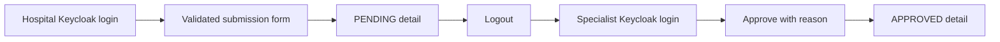

# Operations Portal business analysis

The Operations Portal is a role-aware operational client. It does not own
policy, authorization, claim, invoice, notification, audit or search data.

| Actor | Implemented capability |
| --- | --- |
| `HOSPITAL_USER` | submit and inspect provider-owned pre-authorizations |
| `INSURANCE_SPECIALIST` | inspect queues, approve/reject requests and search across providers |
| `CLAIM_APPROVER` | access claim-oriented operational discovery |
| `SYSTEM_ADMIN` | query bounded service-owned audit journals |

Implemented screens cover dashboard navigation, pre-authorization list/detail/
submission/decision, healthcare search and audit inspection. Loading, empty,
error and forbidden states are explicit. Filters and pagination live in the URL
so operational searches are reproducible and browser navigation remains useful.

The UI never treats a hidden button as authorization. Signed roles control
navigation and interaction affordances, while every API call is re-authorized by
the owning backend. Hospital provider scope comes from the signed
`provider_id`; it cannot be replaced by browser state.

The verified workflow is:

Current visual evidence is catalogued in screenshots `01`–`05` for the primary
workflow, `07` for cross-context search, and `10` for administrator audit access.

