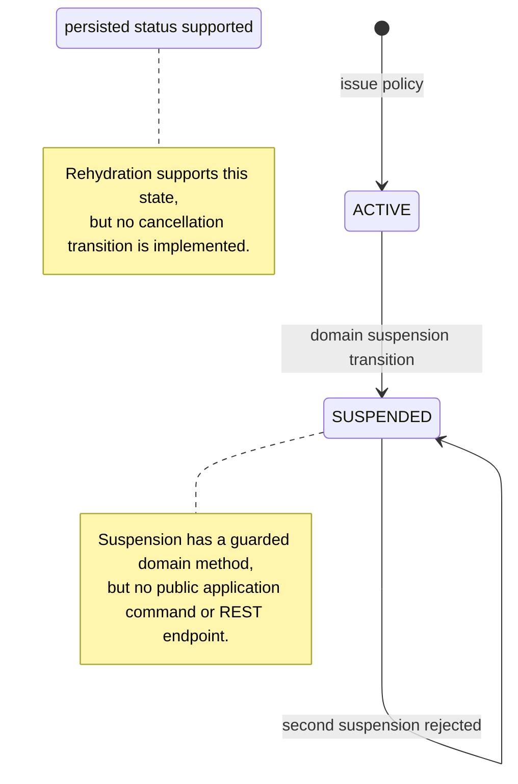
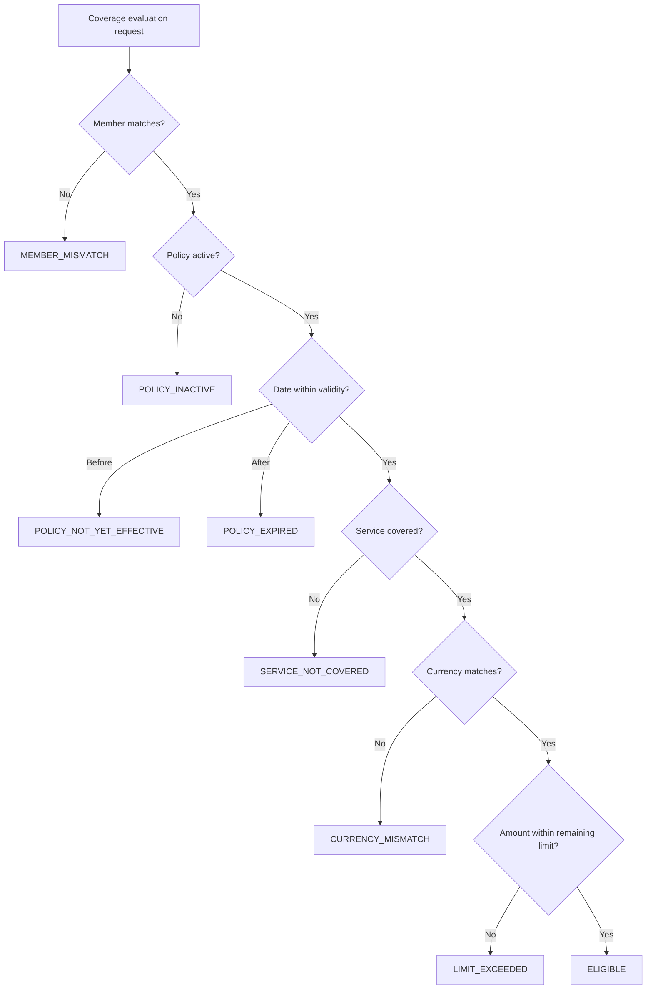

# Policy Service iş analizi

Bu doküman Policy Service'in uygulanmış halini açıklar. Business rule'ları transport ve infrastructure behavior'dan ayırır ve planned capability'leri mevcut feature gibi sunmaz.

## Business amacı ve sahiplik

Servis policy identity, insured member reference, validity, lifecycle status, service coverage, financial limit ve used amount için source of truth'tur. Authorization Service bir pre-authorization request'in covered olup olmadığını sorar; bu rule'ları kopyalayamaz veya Policy database'ini okuyamaz.

| Aktör | Uygulanan capability | Business boundary |
| --- | --- | --- |
| `INSURANCE_SPECIALIST` | Policy issue eder ve coverage evaluate eder | Administrative audit journal'ı sorgulayamaz |
| `HOSPITAL_USER` | Care request gönderirken coverage evaluate eder | Policy issue edemez veya policy audit evidence inceleyemez |
| `SYSTEM_ADMIN` | Policy issue eder, coverage evaluate eder ve audit evidence sorgular | Administrative access bounded ve audited kalır |
| Authorization Service | Initiating user token ile coverage evaluation çağırır | Decision alır, doğrudan database access almaz |

## Ubiquitous language

| Terim | Bu bounded context içindeki anlamı |
| --- | --- |
| Policy | Tek member, validity period, status ve bir veya daha fazla coverage'ı bağlayan aggregate |
| Coverage | Tek unique healthcare service code için benefit definition |
| Limit | Coverage için tanımlanan maximum monetary amount |
| Used amount | Coverage'a daha önce attributed edilmiş persisted utilization |
| Remaining amount | `limit - used`; informative result, reservation değildir |
| Coverage evaluation | Member, service, date, amount ve currency için read-only decision |
| Business denial | Sonucu eligible olmayan valid request; server error yerine decision olarak döner |

## Uygulanan policy lifecycle

Issuance her zaman `ACTIVE` policy oluşturur. Policy non-blank number, tek member, start date'ten önce olmayan end date ve en az bir coverage içermelidir. Service code'lar aggregate içinde unique olmalıdır.

## Coverage decision sequence

İlk eşleşen rule kazanır. Bu ordering, policy başka member'a ait olduğunda coverage detail'lerinin expose edilmesini engeller.

| Priority | Condition | Decision code | Remaining amount açıklanır mı? |
| ---: | --- | --- | --- |
| 1 | Requested member policy member'dan farklı | `MEMBER_MISMATCH` | Hayır |
| 2 | Status `ACTIVE` değil | `POLICY_INACTIVE` | Hayır |
| 3 | Service date `validFrom` öncesinde | `POLICY_NOT_YET_EFFECTIVE` | Hayır |
| 4 | Service date `validUntil` sonrasında | `POLICY_EXPIRED` | Hayır |
| 5 | Service code için coverage yok | `SERVICE_NOT_COVERED` | Hayır |
| 6 | Requested currency coverage currency'den farklı | `CURRENCY_MISMATCH` | Evet |
| 7 | Requested amount remaining amount'u aşıyor | `LIMIT_EXCEEDED` | Evet |
| 8 | Tüm kontroller geçiyor | `ELIGIBLE` | Evet |

Requested amount positive olmalıdır. Coverage limit positive olmalıdır; utilization negative olamaz, limit'i aşamaz veya farklı currency kullanamaz. Bu invariant'lar domain tarafından uygulanır ve defense in depth için PostgreSQL constraint'leriyle tekrarlanır.

## Workflow contract'ları

### Policy issue etmek

Precondition: caller insurer role'üne sahiptir, request valid'dir ve policy number case-insensitive biçimde unique'tir. Application aggregate'i oluşturur, persist eder ve minimized `POLICY_ISSUED` audit evidence'ı aynı local transaction içinde append eder. Ardından ilgili cache entry'lerini invalidate eder. Response `201 Created`'dır; resource query endpoint bulunana kadar bilinçli olarak `Location` içermez.

### Pre-authorization için coverage evaluate etmek

Caller policy number, member ID, service code, service date, amount ve currency sağlar. Cached immutable decision kullanılabilir; aksi halde PostgreSQL policy'yi sağlar ve aggregate decision table'ı uygular. Redis failure PostgreSQL'e fail-open davranır. Denial valid `200 OK` Policy response'dur. Authorization Service bu denial'ı kendi pre-authorization contract'ına translate eder ve request ineligible ise hiçbir şey persist etmez.

Evaluation financial side effect içermez: remaining amount'u ne reserve eder ne consume eder. Güvenli benefit consumption; idempotent reservation/release command'ları, concurrency control ve compensation semantics gerektirir.

## Acceptance scenario'ları ve evidence

Focused `PolicyTest` suite sekiz decision outcome'un tamamını; ayrıca aggregate construction, financial invariant, duplicate service coverage ve suspension davranışını kapsar. Daha geniş service suite ve local runtime evidence [Policy Service architecture](../architecture/policy-service.md) ve [local verification](../development/policy-service-local-verification.md) içinde kaydedilmiştir.

Temel business örnekleri yalnızca sentetik identifier kullanır:

- active policy + matching member/service/currency/date + affordable amount -> `ELIGIBLE`;
- service date policy start öncesinde -> `POLICY_NOT_YET_EFFECTIVE`;
- expired, uncovered, mismatched-member veya mismatched-currency request -> stable denial code;
- remaining limit üzerindeki amount -> `LIMIT_EXCEEDED`, `used` değişmez;
- suspended policy -> `POLICY_INACTIVE`.

## Açık gap'ler ve gelecek kararları

- Public policy detail/list query, suspension command veya cancellation command yoktur.
- Member master data UUID ile referans edilir ancak bu servisin dışında sahiplenilir; issuance şu anda member'ın varlığını doğrulamaz.
- Evaluation benefit reservation değildir; concurrent eligible decision'lar aynı remaining amount'u görebilir.
- Authorization end-user token relay eder; production workload identity veya token exchange uygulanmamıştır.
- Member-mismatch result disclosure'ı minimize eder; ancak currency ve limit denial'larında remaining amount döndürmek explicit API exposure'dır ve insurer/hospital privacy policy açısından review edilmelidir.
- Audit service-local'dır; cross-service timeline database join değil API ile compose edilir.

Bunlar bilinen scope boundary'leridir; tamamlanmış functionality için gizli iddia değildir.
