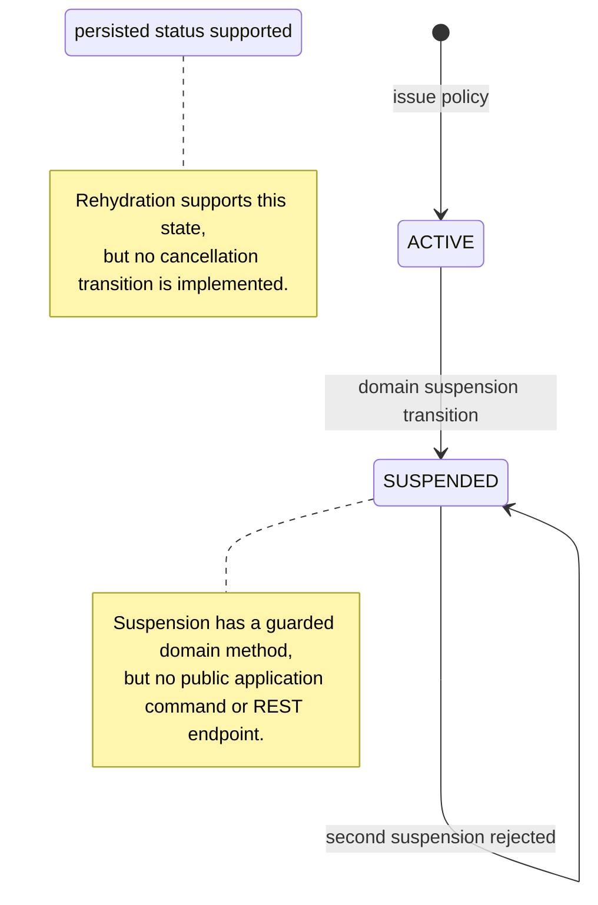
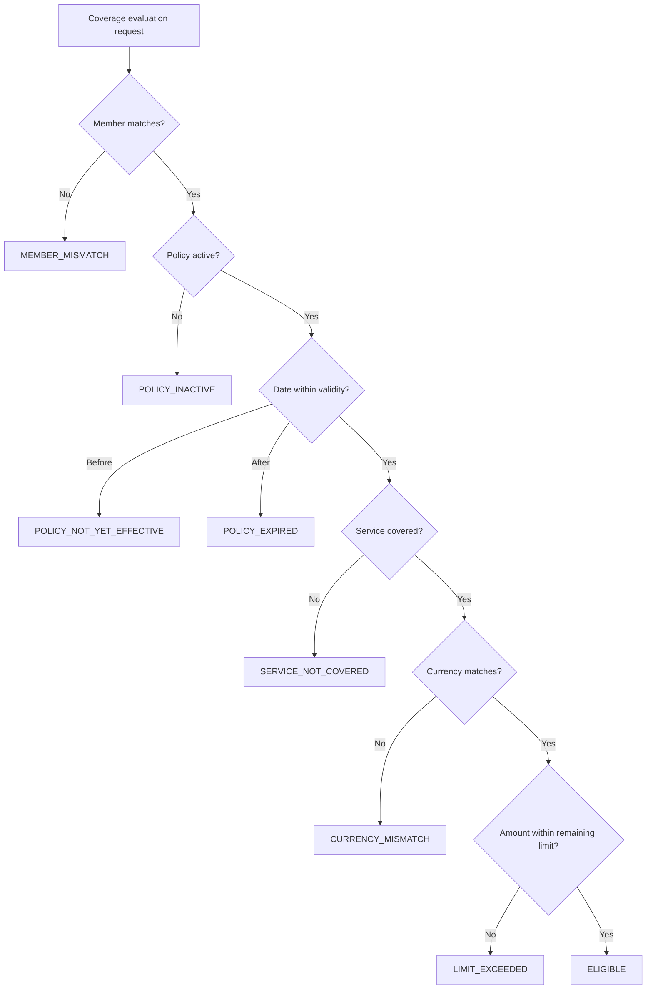

# Policy Service business analysis

This document describes the Policy Service as implemented. It separates
business rules from transport and infrastructure behavior and does not present
planned capabilities as available features.

## Business purpose and ownership

The service is the source of truth for policy identity, the insured member
reference, validity, lifecycle status, service coverage, financial limits, and
used amounts. Authorization Service asks it whether a pre-authorization request
is covered; it must not copy these rules or read the Policy database.

| Actor | Implemented capability | Business boundary |
| --- | --- | --- |
| `INSURANCE_SPECIALIST` | Issue policies and evaluate coverage | Cannot query the administrative audit journal |
| `HOSPITAL_USER` | Evaluate coverage while submitting care requests | Cannot issue policies or inspect policy audit evidence |
| `SYSTEM_ADMIN` | Issue policies, evaluate coverage, and query audit evidence | Administrative access remains bounded and audited |
| Authorization Service | Calls coverage evaluation with the initiating user's token | Receives a decision, never direct database access |

## Ubiquitous language

| Term | Meaning in this bounded context |
| --- | --- |
| Policy | Aggregate that binds one member, a validity period, status, and one or more coverages |
| Coverage | Benefit definition for one unique healthcare service code |
| Limit | Maximum monetary amount defined for a coverage |
| Used amount | Persisted utilization already attributed to that coverage |
| Remaining amount | `limit - used`; informative result, not a reservation |
| Coverage evaluation | Read-only decision for member, service, date, amount, and currency |
| Business denial | Valid request whose result is not eligible; returned as a decision rather than a server error |

## Implemented policy lifecycle

Issuance always creates an `ACTIVE` policy. A policy must have a non-blank
number, one member, an end date not before its start date, and at least one
coverage. Service codes must be unique inside the aggregate.

## Coverage decision sequence

The first matching rule wins. This ordering prevents coverage details from
being exposed when the policy belongs to another member.

| Priority | Condition | Decision code | Remaining amount disclosed |
| ---: | --- | --- | --- |
| 1 | Requested member differs from policy member | `MEMBER_MISMATCH` | No |
| 2 | Status is not `ACTIVE` | `POLICY_INACTIVE` | No |
| 3 | Service date is before `validFrom` | `POLICY_NOT_YET_EFFECTIVE` | No |
| 4 | Service date is after `validUntil` | `POLICY_EXPIRED` | No |
| 5 | No coverage exists for the service code | `SERVICE_NOT_COVERED` | No |
| 6 | Requested currency differs from coverage currency | `CURRENCY_MISMATCH` | Yes |
| 7 | Requested amount exceeds remaining amount | `LIMIT_EXCEEDED` | Yes |
| 8 | All checks pass | `ELIGIBLE` | Yes |

The requested amount must be positive. Coverage limits must be positive;
utilization cannot be negative, exceed the limit, or use a different currency.
These invariants are enforced by the domain and repeated with PostgreSQL
constraints for defense in depth.

## Workflow contracts

### Issue a policy

Preconditions: the caller has an insurer role, the request is valid, and the
policy number is unique case-insensitively. The application constructs the
aggregate, persists it, and appends minimized `POLICY_ISSUED` audit evidence in
one local transaction. It then invalidates related cache entries. The response
is `201 Created`; it deliberately has no `Location` until a resource query
endpoint exists.

### Evaluate coverage for pre-authorization

The caller supplies policy number, member ID, service code, service date,
amount, and currency. A cached immutable decision may be used; otherwise
PostgreSQL supplies the policy and the aggregate applies the decision table.
Redis failure is fail-open to PostgreSQL. A denial is a successful `200 OK`
Policy response. Authorization Service translates that denial to its own
pre-authorization contract and persists nothing when the request is ineligible.

Evaluation has no financial side effect: it neither reserves nor consumes the
remaining amount. Safe benefit consumption would require idempotent reservation
and release commands, concurrency control, and compensation semantics.

## Acceptance scenarios and evidence

The focused `PolicyTest` suite covers all eight decision outcomes plus aggregate
construction, financial invariants, duplicate service coverage, and suspension.
The broader service suite and local runtime evidence are recorded in
[Policy Service architecture](../architecture/policy-service.md) and
[local verification](../development/policy-service-local-verification.md).

Key business examples use synthetic identifiers only:

- active policy + matching member/service/currency/date + affordable amount -> `ELIGIBLE`;
- service date before the policy start -> `POLICY_NOT_YET_EFFECTIVE`;
- expired, uncovered, mismatched-member, or mismatched-currency requests -> stable denial codes;
- amount above the remaining limit -> `LIMIT_EXCEEDED` without changing `used`;
- a suspended policy -> `POLICY_INACTIVE`.

## Explicit gaps and future decisions

- There is no public policy detail/list query, suspension command, or cancellation command.
- Member master data is referenced by UUID but owned outside this service; issuance does not currently verify that the member exists.
- Evaluation is not benefit reservation, so concurrent eligible decisions can observe the same remaining amount.
- Authorization relays the end-user token; production workload identity or token exchange is not implemented.
- The member-mismatch result minimizes disclosure, but returning remaining amount for currency and limit denials is an explicit API exposure that should be reviewed against insurer/hospital privacy policy.
- Audit is service-local; cross-service timelines are composed by API, not database joins.

These are known scope boundaries, not hidden claims of completed functionality.
