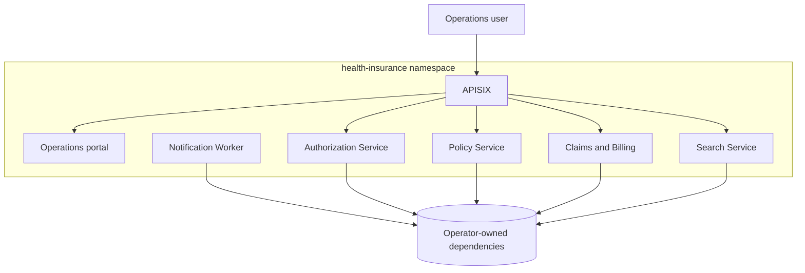

# Kubernetes deployment ve güvenlik

## Deployment sınırı

`deploy/kubernetes/base`, bu repository tarafından sahiplenilen yedi stateless workload'u içerir. Database'ler, broker'lar, IAM, search storage ve observability backend'leri external contract'lardır. Bu yaklaşım database-per-service ownership'i korur ve stateful operasyon taahhütlerini application manifest'lerinin dışında tutar.



```text
deploy/kubernetes/
  base/                    production-oriented resources
  overlays/local/          one-replica Compose-backed developer overlay
  scripts/apply-local.ps1  context-guarded, no-secret-file apply helper
  secrets.example.env      key names only
```

## Güvenlik ve availability kontrolleri

- `health-insurance` namespace üzerinde Restricted Pod Security admission label'ları.
- Java ve Nginx için sabit UID/GID `10001` ve `101`; APISIX doğrulanmış image UID/GID değeri `636` kullanır.
- RuntimeDefault seccomp, tüm Linux capability'lerinin drop edilmesi, privilege escalation'ın kapalı olması ve read-only root filesystem'ler.
- Token automount kapalı, RBAC grant içermeyen dedicated ServiceAccount'lar.
- Default-deny ingress/egress ve yalnızca caller/port bazlı NetworkPolicy izinleri.
- ResourceQuota namespace'in toplam tüketimini sınırlar; LimitRange future workload'lar için güvenli default ve container başına ceiling sağlar.
- Her iki APISIX container aynı immutable registry digest'i kullanır.
- Yedi workload'un tamamında startup, readiness ve liveness probe.
- Request/limit'ler, graceful Spring shutdown, rolling update, topology spread, disruption budget ve konservatif CPU HPA'lar.
- Notification Worker için HPA yoktur: queue-depth scaling external metric adapter gerektirir ve CPU tabanlı consumer scaling'den daha güvenlidir.
- Resource-constrained local overlay her HPA'yı bir replica'da tutar ve `Recreate` kullanır; böylece cold-start CPU nedeniyle local scale-out storm oluşmaz. Production-oriented base rolling update ve gerçek HPA range'lerini korur.

## Render ve policy doğrulaması

```powershell
.\scripts\validate-kubernetes.ps1
kubectl kustomize deploy/kubernetes/base
kubectl kustomize deploy/kubernetes/overlays/local
```

Target namespace apply edildikten sonra live cluster API validation için:

```powershell
.\scripts\validate-kubernetes.ps1 -ServerDryRun -Context portfolio-ci
```

## Local overlay

Local overlay mevcut Compose database, Redis, RabbitMQ, Elasticsearch, Keycloak ve APM portlarının `host.docker.internal` üzerinden erişilebilir olmasını bekler. Portfolio checkpoint disposable `portfolio-ci` Minikube profile'ını kullanır; Kind desteklenen bir alternatif olmaya devam eder. Apply etmeden önce lokal build edilmiş altı application image'ını ve daha önce pull edilmiş APISIX image'ını yükleyin:

```powershell
minikube start -p portfolio-ci --driver=docker --cpus=2 --memory=4096 `
  --kubernetes-version=v1.35.1 `
  --insecure-registry=host.minikube.internal:8088

$images = @(
  'health-insurance/authorization-service:local',
  'health-insurance/policy-service:local',
  'health-insurance/claims-billing-service:local',
  'health-insurance/notification-worker:local',
  'health-insurance/search-service:local',
  'health-insurance/operations-portal:local',
  'apache/apisix:3.18.0-debian'
)
foreach ($image in $images) { minikube image load -p portfolio-ci $image }

.\deploy\kubernetes\scripts\apply-local.ps1 -Context portfolio-ci
kubectl --context portfolio-ci get pods -n health-insurance
```

Helper, `-AllowNonLocalContext` açıkça verilmedikçe local olmayan context'i reddeder. Ignore edilen `.env` value'larını okur ve Secret payload'larını yazdırmaz veya dosyaya yazmaz. APISIX bearer-only compatibility value eksikse memory içinde üretilir.

Overlay `namespace: health-insurance` değerini kendi tanımlar; böylece local ExternalName Service ve NetworkPolicy yanlışlıkla `default` namespace'e düşmez.

Local Kafka consumer ve outbox relay'leri kapalıdır; çünkü Compose client'lara `localhost:9092` advertise eder. Bu, cross-runtime Kafka path çalışıyormuş gibi yanlış bir iddiada bulunmayı engeller. Kafka/RabbitMQ behavior dedicated integration environment içinde doğrulanmaya devam eder.

Her servisi publish etmek yerine port-forwarding kullanın:

```powershell
kubectl --context portfolio-ci port-forward -n health-insurance service/apisix 9080:9080
kubectl --context portfolio-ci port-forward -n health-insurance service/operations-portal 8088:8080
```

## Doğrulanmış gateway checkpoint

2026-09-15 Minikube checkpoint, Kubernetes APISIX Service'i commit edilmiş `demo/verify-api-gateway.ps1` contract'ıyla doğruladı:

```text
missing/invalid token: 401
wrong audience:         403
authorized routing:     200
CORS preflight:         200
oversized payload:      413
rate limit:             429
correlation preserved:  true
```

Test runtime-only Keycloak credential'ları kullandı. Hiçbir backend Service port'u host'a publish edilmedi; APISIX'e temporary port-forward üzerinden erişildi.

## Production integration

Example DNS name'leri ve local image tag'lerini environment overlay üzerinden değiştirin. Secret'ları organizasyonun onaylı external secret controller'ı ile oluşturun; generated Secret YAML commit etmeyin. HPA decision beklemeden önce Metrics Server configure edin, Keycloak ve dependency'ler için trusted TLS kullanın ve CI/CD milestone tarafından sağlanan immutable registry digest'lerini kullanın. Portfolio local overlay bilinçli olarak HTTP kalır: self-signed certificate eklemek production control kanıtlamak yerine trust-store ve browser exception yükü oluşturur. Production environment APISIX üzerinde automatically issued trusted certificate terminate etmeli ve certificate/private-key material'i approved external secret controller veya workload identity üzerinden almalıdır; hiçbir private key Git'e ait değildir.

## GitOps checkpoint

Milestone 12, `deploy/gitops/environments/staging` ve Argo CD `AppProject`/`Application` ekler. Overlay altı application image'ını private Harbor project'e ve tek immutable full Git SHA'ya map eder.

```text
Application: health-insurance-staging
Sync: Synced
Operation: Succeeded
Git revision: 3ce1d4a93e94b670b237a4a387d5be7028696be0
Image revision: 7fc3ea6b1086d3f5be2d7adeb9f43bda6bd6ad8d
```

Application ile yedi Argo CD component aynı Docker node'u paylaştığında local proof için 8 GiB Minikube memory limit gerekir. 4 GiB'de ölçülen node memory kullanımı %99.7'ye ulaştı ve kubelet `container runtime is down` raporladı; live container limit yükseltildiğinde cluster yeniden oluşturulmadan `Ready` durumu geri geldi. Installer ayrıca Docker Desktop I/O latency altında false restart'ları önlemek için cached pinned image'lar ve gevşetilmiş local probe timing kullanır.

Operator-owned Secret'lar ile external PostgreSQL, Kafka, RabbitMQ, Redis, Elasticsearch, Keycloak ve APM endpoint'leri mevcut olana kadar workload health'in `Progressing` veya `Degraded` olması beklenir. Argo sync success desired-state delivery'yi kanıtlar; eksik stateful production dependency'leri sağlıklıymış gibi göstermez.
