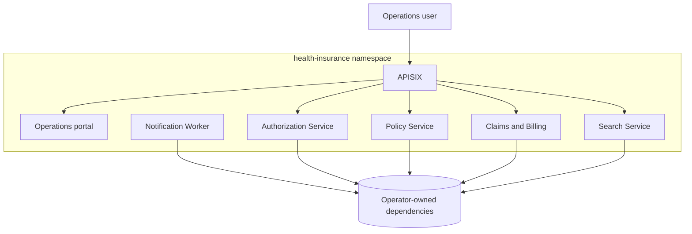

# Kubernetes deployment and security

## Deployment boundary

`deploy/kubernetes/base` contains the seven stateless workloads owned by this
repository. Databases, brokers, IAM, search storage and observability backends
are external contracts. This preserves database-per-service ownership and keeps
stateful operational promises out of application manifests.



```text
deploy/kubernetes/
  base/                    production-oriented resources
  overlays/local/          one-replica Compose-backed developer overlay
  scripts/apply-local.ps1  context-guarded, no-secret-file apply helper
  secrets.example.env      key names only
```

## Security and availability controls

- Restricted Pod Security admission labels on `health-insurance`.
- Fixed UID/GID `10001` for Java and `101` for Nginx; APISIX uses its verified
  image UID/GID `636`.
- RuntimeDefault seccomp, all Linux capabilities dropped, no privilege
  escalation and read-only root filesystems.
- Dedicated ServiceAccounts with token automount disabled and no RBAC grants.
- Default-deny ingress/egress plus caller- and port-specific NetworkPolicies.
- ResourceQuota bounds aggregate namespace consumption; LimitRange supplies
  safe defaults and per-container ceilings for future workloads.
- Both APISIX containers use the same immutable registry digest.
- Startup, readiness and liveness probes on all seven workloads.
- Requests/limits, graceful Spring shutdown, rolling updates, topology spread,
  disruption budgets and conservative CPU HPAs.
- No HPA for Notification Worker: queue-depth scaling requires an external
  metric adapter and is safer than CPU-based consumer scaling.
- The resource-constrained local overlay keeps every HPA at one replica and
  uses `Recreate`, preventing cold-start CPU from causing a local scale-out
  storm. The production-oriented base retains rolling updates and real HPA
  ranges.

## Render and policy validation

```powershell
.\scripts\validate-kubernetes.ps1
kubectl kustomize deploy/kubernetes/base
kubectl kustomize deploy/kubernetes/overlays/local
```

For a live cluster API validation after the target namespace has been applied:

```powershell
.\scripts\validate-kubernetes.ps1 -ServerDryRun -Context portfolio-ci
```

## Local overlay

The local overlay expects the existing Compose databases, Redis, RabbitMQ,
Elasticsearch, Keycloak and APM ports on `host.docker.internal`. The portfolio
checkpoint uses the disposable `portfolio-ci` Minikube profile; Kind remains a
supported alternative. Load the six locally built application images and the
already-pulled APISIX image before applying:

```powershell
minikube start -p portfolio-ci --driver=docker --cpus=2 --memory=4096 `
  --kubernetes-version=v1.35.1 `
  --insecure-registry=host.minikube.internal:8088

$images = @(
  'health-insurance/authorization-service:local',
  'health-insurance/policy-service:local',
  'health-insurance/claims-billing-service:local',
  'health-insurance/notification-worker:local',
  'health-insurance/search-service:local',
  'health-insurance/operations-portal:local',
  'apache/apisix:3.18.0-debian'
)
foreach ($image in $images) { minikube image load -p portfolio-ci $image }

.\deploy\kubernetes\scripts\apply-local.ps1 -Context portfolio-ci
kubectl --context portfolio-ci get pods -n health-insurance
```

The helper refuses a non-local context unless `-AllowNonLocalContext` is
explicitly provided. It reads ignored `.env` values and does not print or write
Secret payloads. APISIX's bearer-only compatibility value is generated in
memory when it is absent.

The overlay declares `namespace: health-insurance` itself so its local
ExternalName Service and NetworkPolicy cannot accidentally land in `default`.

Local Kafka consumers and outbox relays are disabled because Compose advertises
`localhost:9092` to clients. This avoids claiming a working cross-runtime Kafka
path. Kafka/RabbitMQ behavior remains verified in the dedicated integration
environment.

Use port-forwarding instead of publishing every service:

```powershell
kubectl --context portfolio-ci port-forward -n health-insurance service/apisix 9080:9080
kubectl --context portfolio-ci port-forward -n health-insurance service/operations-portal 8088:8080
```

## Verified gateway checkpoint

The 2026-09-15 Minikube checkpoint verified the Kubernetes APISIX Service with
the committed `demo/verify-api-gateway.ps1` contract:

```text
missing/invalid token: 401
wrong audience:         403
authorized routing:     200
CORS preflight:         200
oversized payload:      413
rate limit:             429
correlation preserved:  true
```

The test used runtime-only Keycloak credentials. No backend Service port was
published to the host; APISIX was reached through a temporary port-forward.

## Production integration

Replace example DNS names and local image tags through an environment overlay.
Create Secrets through the organization's approved external secret controller;
do not commit generated Secret YAML. Configure Metrics Server before expecting
HPA decisions, use trusted TLS for Keycloak and dependencies, and use immutable
registry digests supplied by the CI/CD milestone.

## GitOps checkpoint

Milestone 12 adds `deploy/gitops/environments/staging` and an Argo CD
`AppProject`/`Application`. The overlay maps all six application images to the
private Harbor project and one immutable full Git SHA.

```text
Application: health-insurance-staging
Sync: Synced
Operation: Succeeded
Git revision: a56fff2a14405d3024b98f357b1c3b38edd8384b
Image revision: 7fc3ea6b1086d3f5be2d7adeb9f43bda6bd6ad8d
```

`Progressing` or `Degraded` workload health is expected until operator-owned Secrets and
external PostgreSQL, Kafka, RabbitMQ, Redis, Elasticsearch, Keycloak, and APM
endpoints exist. Argo sync success proves desired-state delivery; it does not
misrepresent absent stateful production dependencies as healthy.
