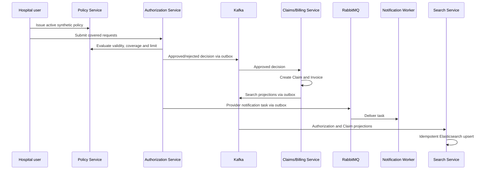

# Backend uçtan uca lokal doğrulama

Bu checkpoint Operations Portal kullanmadan, service-owned store'lar ve asynchronous boundary'ler boyunca uygulanmış workflow'u doğrular. Her service unit suite'ini tekrar etmez.

## Doğrulanan path

APISIX bilinçli olarak checkpoint dışında tutuluyorsa mevcut synthetic seeder'ı short-lived Keycloak token'lar ve direct local service URL'leriyle çalıştırın. Password veya token asla yazdırmayın veya persist etmeyin. Executable source of truth `demo/seed-demo-data.ps1` dosyasıdır.

## Doğrulanmış sonuç — 2026-09-14

Run `20260914231932` şu evidence ile tamamlandı:

| Boundary | Evidence |
| --- | --- |
| Policy PostgreSQL | bir `ACTIVE` policy |
| Authorization PostgreSQL | bir `PENDING`, bir `REJECTED`, iki `APPROVED` request |
| Claims/Billing PostgreSQL | iki `APPROVED` Claim; invoice'lar `SETTLED` ve `DISPUTED` |
| RabbitMQ/Notification PostgreSQL | üç task `DELIVERED`; bir active consumer |
| Elasticsearch | yalnızca generated policy'ye ait beş record |
| Audit trail | Settled path için Authorization 2, Policy 1, Claim 3, Invoice 5 record |

Final JSON summary `SYNTHETIC_DEMO_ONLY`, üç delivered notification, settled invoice, bilinçli olarak disputed invoice ve beş matching operations-search document raporladı.

## Checkpoint'in ortaya çıkardığı defect'ler

1. `127.0.0.1` üzerinden istenen token'lar, configured `http://localhost:8080` issuer'dan farklı issuer taşıyordu. Safe local procedure artık token issuance için `localhost` kullanır.
2. Search, owner'ın publish ettiği `PreAuthorizationApproved` veya `PreAuthorizationRejected` yerine uydurma `PreAuthorizationDecided` event name bekliyordu. Consumer validation artık gerçek type'ı ve decision ile tutarlılığını kontrol eder.
3. Elasticsearch `simple_query_string`, policy number içindeki hyphen'ları query syntax olarak yorumlayıp match-all false positive üretiyordu. Plain user input artık AND `multi_match` query ile ele alınır.
4. Demo, dört üzerindeki herhangi bir search total'ını kabul ediyordu. Artık dönen her record'un generated policy'ye ait olduğunu ve en az dört matching projection bulunduğunu doğrular.
5. Source-run Claims service optional search relay'i kapalı çalışıyordu. Checkpoint `CLAIM_SEARCH_OUTBOX_ENABLED=true` etkinleştirdi; Compose bu production-like local wiring'i zaten açıkça ayarlar.

## Portfolio evidence

Cross-service proof terminal screenshot içinde identifier göstermemek için mevcut focused image'ların bileşiminden oluşur. Screenshot kataloğunda Search (`07`), Authorization/Kafka/RabbitMQ (`19`–`22`), Claims/PostgreSQL/Kafka (`23`–`24`) ve Notification Worker (`25`) görsellerine bakın.
