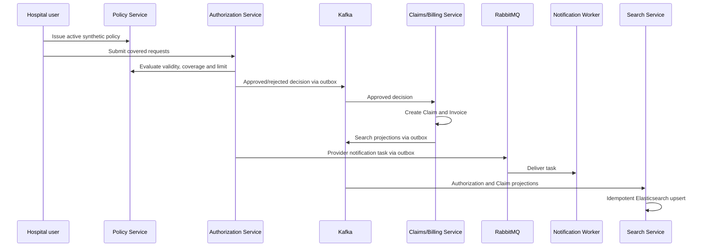

# Backend end-to-end local verification

This checkpoint verifies the implemented workflow across service-owned stores
and asynchronous boundaries without using the Operations Portal. It does not
repeat every service unit suite.

## Verified path

Run the existing synthetic seeder with short-lived Keycloak tokens and direct
local service URLs when APISIX is intentionally outside the checkpoint. Never
print or persist passwords or tokens. The executable source of truth is
`demo/seed-demo-data.ps1`.

## Verified result — 2026-09-14

Run `20260914231932` completed with:

| Boundary | Evidence |
| --- | --- |
| Policy PostgreSQL | one `ACTIVE` policy |
| Authorization PostgreSQL | one `PENDING`, one `REJECTED`, two `APPROVED` requests |
| Claims/Billing PostgreSQL | two `APPROVED` Claims; invoices `SETTLED` and `DISPUTED` |
| RabbitMQ/Notification PostgreSQL | three tasks reached `DELIVERED`; one active consumer |
| Elasticsearch | five records belonging only to the generated policy |
| Audit trail | Authorization 2, Policy 1, Claim 3, Invoice 5 records for the settled path |

The final JSON summary reported `SYNTHETIC_DEMO_ONLY`, three delivered
notifications, a settled invoice, a deliberately disputed invoice, and five
matching operations-search documents.

## Defects discovered by the checkpoint

1. Tokens requested through `127.0.0.1` carried an issuer different from the
   configured `http://localhost:8080` issuer. The safe local procedure now uses
   `localhost` for token issuance.
2. Search expected the invented event name `PreAuthorizationDecided`, while the
   owner publishes `PreAuthorizationApproved` or `PreAuthorizationRejected`.
   Consumer validation now checks the real type and its consistency with the
   decision.
3. Elasticsearch `simple_query_string` interpreted hyphens in a policy number
   as query syntax and produced a match-all false positive. Plain user input is
   now handled by an AND `multi_match` query.
4. The demo accepted any search total greater than four. It now verifies that
   every returned record belongs to the generated policy and that at least four
   matching projections exist.
5. A source-run Claims service had its optional search relay disabled. The
   checkpoint enabled `CLAIM_SEARCH_OUTBOX_ENABLED=true`; Compose already sets
   this production-like local wiring explicitly.

## Portfolio evidence

The cross-service proof is intentionally composed from existing focused images
rather than a terminal screenshot containing identifiers. See Search
(`07`), Authorization/Kafka/RabbitMQ (`19`–`22`), Claims/PostgreSQL/Kafka
(`23`–`24`), and Notification Worker (`25`) in the screenshot catalogue.

