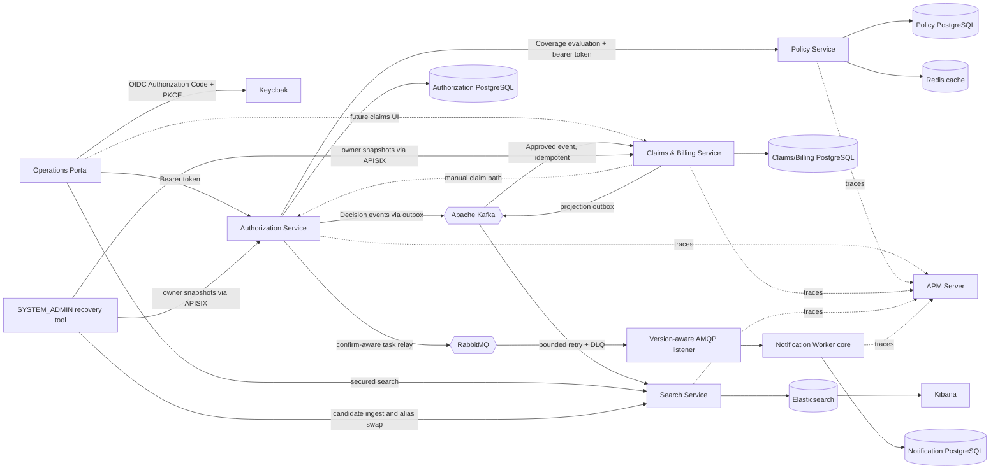

# Technical Walkthrough: Milestones 0–7

This document explains the implemented system through Milestone 8. It is a
living technical narrative: every completed milestone updates it, the README, the
architecture diagrams, the demo, and relevant screenshots.

## 1. Portfolio story

The platform demonstrates a move from enterprise healthcare development into a
modern Java and React stack without discarding the underlying domain knowledge.
It models a provider asking an insurer to authorize a healthcare service, the
insurer checking policy coverage and making a decision, and an approved service
becoming a claim, invoice, reconciliation, and payment workflow.

This is not a collection of independent CRUD screens. The central value is in
the invariants and boundaries:

- a provider cannot act on another provider's records;
- an expired, inactive, mismatched, uncovered, over-limit, or wrong-currency
  policy cannot produce a pending pre-authorization;
- only an approved pre-authorization can start a claim;
- decisions are legal state transitions, not arbitrary status updates;
- an invoice cannot be overpaid and only becomes settled when fully paid;
- concurrent decisions are detected using optimistic locking;
- each service owns its database and communicates through an API, never through
  another service's tables.

## 2. Delivered milestones

### Milestone 0 — Reproducible Java 21 foundation

The backend, Dockerfiles, and GitHub Actions were aligned on Java 21. Maven
Wrapper keeps Maven execution reproducible. Docker uses multi-stage builds so
Maven is absent from the runtime image, and the final process runs as a
non-root user. Spring Boot actuator health endpoints support local diagnostics.

### Milestone 1 — Authorization bounded context

The Authorization Service was reorganized around Clean Architecture. The
`PreAuthorization` aggregate owns submission and decision invariants. Input
ports describe the operations that the application offers; output ports
describe persistence and coverage verification needs. Spring configuration
composes plain application services with transactional decorators. JPA, OAuth2,
HTTP, and Spring MVC stay in outer adapters.

The service offers submission, paginated work-queue search, detail, approval,
and rejection. Hospital results are restricted by the authenticated provider;
specialists and administrators can query across providers. JPA `@Version`
detects competing decisions and maps them to a conflict response.

### Milestone 2 — Operations portal

The Vite, React, and TypeScript application uses a pragmatic Feature-Sliced
dependency direction: `app -> pages -> widgets -> features -> entities ->
shared`. TanStack Query owns remote server state. React Hook Form and Zod own
form state and validation. A shared typed client attaches the Keycloak access
token and translates RFC 9457 responses into UI errors.

The current portal scope is intentionally focused on pre-authorizations:
dashboard summary cards, a filterable/sortable/paginated work queue, submission,
detail, and specialist approval/rejection. Role-aware navigation and controls
supplement server-side authorization; they never replace it.

### Milestone 3 — Policy bounded context

The Policy Service became the source of truth for policy validity and coverage.
A policy contains dated validity, status, member ownership, and one or more
coverage definitions. Each coverage protects service code, currency, monetary
limit, and covered amount rules.

Authorization verifies coverage synchronously through an application output
port before it stores a pre-authorization. The REST adapter is fail-closed:
business denial and dependency failure do not create a pending request. This
choice gives the hospital an immediate answer and keeps policy rules in one
service. It also introduces temporal coupling, documented as a conscious
trade-off in ADR-005.

Coverage evaluation is a read-only eligibility decision. It does not reserve
or consume a benefit limit. Cross-request limit accounting is therefore a
known future domain requirement rather than a hidden claim of the current
system.

### Milestone 4 — Claims and Billing bounded context

An approved pre-authorization can start one claim and its invoice. Claims and
billing live in one bounded context for now because adjudication, reconciliation,
and payment require a local transaction and evolve together. They are separate
aggregate roots: `Claim` owns adjudication; `Invoice` owns payable amount,
disputes, payment references, and settlement.

Claims move from `SUBMITTED` to `UNDER_REVIEW`, then to `APPROVED` or
`REJECTED`. Approval sets the insurer-approved amount and reconciles the
invoice. A short payment produces `DISPUTED`; agreeing a payable amount moves it
to `MATCHED`; payments accumulate until `SETTLED`. Rejecting a claim voids an
unpaid invoice. Unique invoice numbers, pre-authorization references, and
payment references add database-backed replay protection.

### Milestone 5 — Reliable event-driven claim initiation

Authorization records a versioned decision event in its local outbox in the
same transaction as the aggregate decision. A scheduled relay publishes the
event to Kafka and only then marks it delivered. A crash in that small window
can produce a duplicate, so Claims/Billing treats idempotency as part of the
application contract: claim, invoice, and `processed_messages` marker commit in
one transaction. Approval starts the financial process eventually; rejection
is published as a durable fact but has no Claims/Billing action.

Broker errors leave the outbox row pending for a later poll. Consumer failures
are attempted three times with fixed backoff and then moved to a DLT. A Saga was
not added because there is no multi-step distributed compensation policy yet.

### Milestone 6 — Notification delivery

The Notification Worker now has a framework-independent delivery aggregate,
application use case, repository/sender ports, and private PostgreSQL schema.
Its `taskId` is both the database primary key and the future downstream-provider
idempotency key. Delivered replays are no-ops; received tasks remain retryable;
reusing a task identifier for different intent is rejected as a contract error.

The persistence adapter stores only technical identifiers, a provider reference,
notification type, template key, state, and timestamps. It does not store member,
policy, diagnosis, email, phone, token, or rendered-content data. Liquibase owns
the schema and database check constraints mirror the aggregate's state/timestamp
invariants.

Authorization now creates a second, dedicated outbox record for notification
work. The pre-authorization decision, Kafka business event, and minimal
notification task share one local transaction. A PostgreSQL integration test
proves both the successful three-write commit and rollback of the decision plus
both outboxes when notification task persistence fails.

A scheduled Authorization adapter now locks pending task rows and maps each to
a persistent, versioned JSON message. It waits for a correlated RabbitMQ
publisher confirm and checks mandatory publisher returns before setting
`published_at`; `nack`, timeout, serialization failure, and unroutable results
remain pending for another poll. Durable direct exchanges, a delivery queue,
and its dead-letter route are declared in code. These producer behaviors are
unit-tested. The worker now converts the v1 JSON contract into a framework-free
command, invokes a transaction-decorated use case, and manually acknowledges
only after commit. Invalid versions and processing failures are rejected without
requeue. A safe log adapter demonstrates the sender port without claiming email
or SMS.

RabbitMQ now runs in Compose with a durable direct exchange, delivery queue,
dead-letter exchange, and DLQ. The listener retries only explicit transient
delivery failures: three total attempts with bounded exponential backoff by
default. Contract/version and invariant failures are permanent and go directly
to the DLQ. Retry surrounds the transaction proxy so every attempt starts a new
transaction; only a committed success is acknowledged. PostgreSQL/RabbitMQ
Testcontainers prove duplicate suppression and real dead-letter routing, while
the synthetic Compose demo proves three decisions reach `DELIVERED`.

### Milestone 7 — Cache, search, and observability

Policy's application service depends on a `CoverageEvaluationCache` port, not on
Redis. It asks the cache before loading the aggregate and stores the resulting
decision for 30 seconds. The adapter hashes the complete evaluation identity so
Redis keys do not reveal member or policy identifiers. Reads, writes, and
invalidation fail open to PostgreSQL; only the authoritative dependency failure
prevents Authorization from accepting an unverified request.

Cross-context operations search is a new read-model bounded context. Every
Claims/Billing transition persists a complete `ClaimSearchProjection` beside the
aggregate in one transaction. A scheduled relay publishes the projection to
Kafka, while Search Service also consumes Authorization decision events. It maps
both contracts into deterministic Elasticsearch documents. This gives at-least-
once idempotency without allowing Search to mutate or impersonate source
aggregates. Hospital queries are always replaced with the signed provider scope.

The portal's new Search entity/API/page slice talks to port 8084 and retains
filters and pagination in the URL. TanStack Query owns remote state. The shared
HTTP client creates `X-Correlation-ID`; servlet filters validate and echo it,
REST clients forward it, and asynchronous listeners derive it from event/task
metadata. Spring Boot renders MDC as ECS JSON. Docker attaches the Elastic Java
agent externally, so tracing concerns do not enter domain or application code.

### Milestone 8 — Gateway security boundary

APISIX is the only host-published business API origin. It validates Keycloak
tokens at the edge and applies shared traffic, CORS, payload, timeout, header,
and correlation policies. Each service still validates the token and owns its
provider/role authorization decisions: gateway authentication does not replace
application authorization.

### Milestone 9 — Audit and governance

The audit design is service-owned and append-only. This avoids coupling every
business transaction to a central audit service and lets the audit row commit
atomically with the state it describes. Authorization records submission,
approval, and rejection; Policy records policy issuance; Claims/Billing records
claim adjudication, invoice reconciliation/void/dispute resolution, and payment.
Each application core depends on a framework-free `AuditTrail` output port.

The contract captures a controlled action, actor subject/roles, provider scope,
correlation ID, timestamp, controlled reason code, status delta, and retention
class. It intentionally cannot accept business snapshots or free text. A JDBC
adapter writes the journal, and Liquibase adds database triggers that reject
update, delete, and truncate. PostgreSQL Testcontainers prove both the positive
path and fail-closed rollback: if audit persistence fails, the governed business
mutation and related outboxes roll back.

Each service also owns a query port, use case, JDBC read adapter, and REST
controller for its journal. Both controller and use case require `SYSTEM_ADMIN`;
filters are restricted to aggregate UUID and service-local action allowlists,
page size is capped at 100, and ordering uses timestamp plus audit ID. APISIX
routes the three APIs, while the React Audit Trail page selects one service at a
time. This preserves database-per-service ownership: the UI is unified, the data
stores are not. The repeatable synthetic demo asserts minimum evidence counts for
policy, authorization, claim, invoice, and payment transitions.

Retention classes describe handling intent rather than inventing legal periods.
Lawful basis, approved durations, disposal jobs, backup erasure, encryption/key
management, and regulatory sign-off remain explicit production responsibilities.

### Milestone 10 — Search and messaging recovery

Elasticsearch is explicitly derived state, so “rebuildable” now means an
executable owner-driven process rather than a promise. Authorization and
Claims/Billing each expose a narrow, stable, `SYSTEM_ADMIN` projection-export
use case over only their own database. The local orchestrator pages both APIs
through APISIX and sends the current snapshots to Search; neither Search nor the
script receives database credentials or JPA entities.

Search creates a versioned physical candidate while reads and normal event
writes continue through the `healthcare-operations` alias. Ingestion validates
the same domain record used by event consumers. Activation refreshes the
candidate, compares its count to the orchestrator's distinct deterministic ID
count, and atomically moves the alias only if it still targets the recorded
predecessor. The predecessor is retained, so rollback is another alias
compare-and-swap rather than a restore from backup.

Deterministic IDs alone cannot stop a delayed event from overwriting a newer
snapshot. The event and export contracts therefore carry an owner-defined
monotonic `sourceRevision`; Elasticsearch uses a scripted conditional upsert.
Authorization derives it from its aggregate version, while Claims/Billing
combines Claim and Invoice versions because both contribute to one search
document. Legacy documents/messages without the additive field map to revision
1, which preserves compatibility until the rebuild replaces them.

Messaging recovery is deliberately operator-assisted. A status script reports
outbox age/attempts, Kafka group lag, and RabbitMQ depth without payloads. The
Kafka DLT and RabbitMQ DLQ tools inspect SHA-256/size/routing metadata, require a
transient classification and explicit flag for replay, cap batch/attempts, and
copy only to allowlisted routes while retaining the original dead letter.
Idempotent consumers make a valid duplicate safe; they do not repair a permanent
contract error.

## 3. Architecture at runtime

The current service-to-service calls relay the caller's access token. This
preserves end-user authorization and provider ownership in the receiving
service. A production deployment may use token exchange or workload identity;
that change requires a separate trust-model decision.

## 4. Request path through Clean Architecture

For a typical command:

1. A REST controller validates the transport request and maps JWT claims to an
   application `ActorContext`.
2. The controller invokes an input port rather than persistence directly.
3. A transactional decorator defines the unit-of-work boundary without placing
   Spring annotations in the application layer.
4. The application service checks authorization, coordinates the aggregate,
   and calls output ports.
5. The aggregate/value objects enforce state and monetary invariants.
6. Infrastructure adapters translate between domain objects and JPA entities or
   remote HTTP representations.
7. The exception advice returns an RFC 9457 Problem Details response.

Queries use dedicated input and output models. This is lightweight CQRS: read
and write use cases are explicit, but the system does not maintain a separate
read database.

## 5. Domain model and invariants

### Authorization

- `PreAuthorization` is the aggregate root.
- `Money` prevents negative values and mismatched currency operations.
- `PENDING -> APPROVED|REJECTED` are the only decision transitions.
- A second decision is rejected at the domain level; a concurrent stale write
  is rejected by persistence-level optimistic locking.
- Provider ownership comes only from `provider_id` in the trusted token.

### Policy

- `Policy` is the aggregate root and owns its coverage collection.
- Validity is inclusive and evaluated against an injected `Clock`.
- Member, status, date, service code, currency, and maximum amount must all
  match for coverage to be granted.
- Policy data is private to the Policy Service.

### Claims and billing

- `Claim` and `Invoice` are separate aggregate roots sharing one bounded
  context and transaction where necessary.
- A claim is linked to one approved pre-authorization and one invoice.
- Approved amount cannot exceed the invoiced amount.
- Payment amount must be positive; cumulative payments cannot exceed payable
  amount; payment reference is unique.
- Provider-scoped reads prevent cross-tenant disclosure.

See [Data model](architecture/data-model.md) and
[workflow sequences](architecture/workflow-sequences.md) for the detailed
relationships and message order.

## 6. Security model

Keycloak authenticates users. Each API validates issuer, signature, expiry, and
realm roles as an OAuth2 resource server. The implemented roles are:

| Role | Current responsibility |
| --- | --- |
| `HOSPITAL_USER` | Submit/read provider-owned pre-authorizations and claims |
| `INSURANCE_SPECIALIST` | Decide pre-authorizations and perform reconciliation/payments |
| `CLAIM_APPROVER` | Review, approve, or reject claims |
| `SYSTEM_ADMIN` | Administrative read and policy/reconciliation authority |

Authorization exists twice by design: controller annotations reject invalid
endpoint access early, while application services enforce the same business
authority independent of HTTP. Hospital users additionally require a UUID
`provider_id` token claim. Request bodies never select the provider identity.

The imported realm declares `providerId` as a managed Keycloak user-profile
attribute. Users may view it but only administrators may edit it. The public
PKCE client maps it into the signed `provider_id` claim; relying on an
undeclared custom attribute would fail because Keycloak 26 ignores unmanaged
attributes by default.

The repository contains no real patient data or credentials. Demo identifiers
are synthetic UUIDs; credentials and tokens remain runtime-only environment
variables. Logs and errors must not include tokens or health information.

## 7. Persistence and consistency

Each state-owning backend component has an independent Liquibase changelog. The
three API services and Notification Worker use four private PostgreSQL 17
databases in Compose. RabbitMQ is a transport, not a source of domain ownership;
the producer outbox and worker delivery table retain durable intent/outcome.
JPA entities are persistence representations, separate from the domain model.
This avoids Spring/JPA annotations in the domain and lets mappings evolve at the
adapter boundary.

Transactions are placed around input ports in infrastructure decorators.
`@Version` protects mutable aggregate rows. Unique constraints protect stable
business references against duplicate submission. The transactional outbox
extends the local ACID boundary to durable intent-to-publish without pretending
PostgreSQL and Kafka share one transaction. Delivery remains at least once; the
consumer inbox and business-key constraints make replay safe.

## 8. Error semantics and resilience

APIs use RFC 9457 Problem Details for validation, authentication/authorization,
not-found, business conflict, and dependency errors. Synchronous validation
calls are fail-closed and use explicit timeouts. Kafka consumption has bounded
retry and DLT recovery; outbox publication retries on later scheduled polls.
RabbitMQ consumption classifies transient versus permanent failures, gives each
transient attempt a fresh transaction, and dead-letters exhausted/permanent work.
Circuit breakers for synchronous HTTP dependencies are still not implemented.

## 9. Test strategy and evidence

The backend test portfolio contains framework-free domain/application unit
tests, MVC/security slice tests, Spring bean-wiring tests, ArchUnit dependency
tests, and PostgreSQL Testcontainers integration/concurrency tests. Kafka tests
use the official Apache Kafka Testcontainer to prove duplicate delivery and
poison-message DLT behavior. The frontend uses Vitest, Testing Library, and architecture tests for FSD import direction,
plus linting and a production TypeScript/Vite build.

On 8 September 2026, the Milestone 5 checkpoint was verified on Java 21.0.8
and Docker Desktop 28.5.1. The three Maven suites contained 109 passing tests:
Authorization 50, Policy 21, and Claims/Billing 38. The portal passed oxlint,
all 6 Vitest tests in 5 files, and the production TypeScript/Vite build. Treat
these numbers as dated evidence, not a permanent guarantee; the commands in the
README are the source of truth for a fresh checkout.

The Notification Worker suite covers domain, application, persistence,
architecture, configuration, retry/acknowledgement, and real-broker behavior.
Its integration tests use PostgreSQL 17 and RabbitMQ 4.1 containers rather than
in-memory substitutes. They prove that duplicate messages result in one
`DELIVERED` row and that an unsupported version is quarantined in the real DLQ.
On 8 September 2026 all four backend suites passed 141 tests: Authorization 59,
Policy 21, Claims/Billing 38, and Notification Worker 23.
Authorization now has 59 passing tests, including two full-context PostgreSQL
tests for the multi-write decision transaction and five AMQP relay/topology unit
tests. The latter verify positive/nack/unroutable outcomes, safe persistent
message metadata, and durable dead-letter routing without claiming a live broker.

On 10 September 2026, the Milestone 10 quality gate passed **193 backend tests**:
Authorization 73, Policy 33, Claims/Billing 51, Notification Worker 23, and
Search Service 13. The new proof includes real PostgreSQL owner-export queries,
application authorization/bounds, conditional stale-revision handling,
legacy-document compatibility, count-gated activation, atomic alias swaps, and
retained-index rollback against Elasticsearch 9.5.3. The portal passed oxlint,
9 Vitest tests in 8 files, and a production build. A live Compose rehearsal
activated 70 distinct current projections while retaining the 55-document v1
predecessor.

The documentation has its own executable quality gate. It validates local
Markdown links, parses the Keycloak and demo JSON, parses the PowerShell demo
and recovery scripts, verifies the eleven expected PNG files, and renders every Mermaid block
with Mermaid CLI. This prevents a diagram or portfolio link from silently
rotting while later milestones change the implementation.

## 10. Delivery and local operations

Docker Compose runs Keycloak, APISIX, Kafka, RabbitMQ, Redis, four API services,
Notification Worker, four private databases, Elasticsearch, Kibana, and APM
Server.
Required credentials are supplied from an ignored `.env`, using `.env.example`
as a safe template. Health checks order database-dependent startup. GitHub
Actions independently tests backend services and the operations portal using
Java 21 and Node.

APISIX is a file-driven data plane: no etcd or mutable Admin API is needed for
the local topology. It authenticates external bearer tokens, applies traffic
policy, and routes to unpublished Spring ports. It deliberately does not own
provider or aggregate authorization; Spring repeats token validation and the
application layer enforces those business rules. Gateway-native errors are
adapted to RFC 9457 without rewriting business errors from upstream services.

The realm declares a bearer-only `health-insurance-api` audience client. Keycloak
adds that audience to portal and demo access tokens, and APISIX requires an exact
audience match. A token may therefore be cryptographically valid for the realm but
still be rejected when it was issued for another resource.

The repository does not yet contain Kubernetes, Jenkins, SonarQube,
Nexus, Harbor, or Argo CD implementations. Those remain planned slices and will only be added
when they solve an explicit operational or domain problem.

## 11. .NET-to-Java mapping

| Familiar .NET concept | Current project equivalent |
| --- | --- |
| ASP.NET Core Controller | Spring MVC REST controller |
| ASP.NET Core DI | Spring IoC configuration and beans |
| EF Core entity/configuration | JPA entity and repository adapter |
| `DbContext` transaction | Spring `@Transactional` decorator |
| FluentValidation/data annotations | Bean Validation + Zod in the browser |
| ASP.NET authentication handler | Spring Security OAuth2 resource server |
| Authorization policy | `@PreAuthorize` plus application authorization |
| ProblemDetails | RFC 9457 Spring `ProblemDetail` response |
| NuGet/MSBuild | Maven Wrapper |
| React query/service hooks | TanStack Query feature hooks |
| `appsettings.json` | `application.yml` and environment variables |
| EF concurrency token | JPA `@Version` |
| EF Core transactional outbox table | JPA outbox adapter + scheduled relay |
| MassTransit consumer/error transport | Spring Kafka listener + DLT or Spring AMQP listener + DLQ |
| EF Core persistence adapter | Notification JPA entity + repository adapter |
| `IDistributedCache` adapter | Redis-backed cache output port with explicit fallback |
| Elasticsearch .NET client/read model | Elastic Java Client projection adapter |
| Serilog ECS + `LogContext` | Spring Boot ECS logging + SLF4J MDC |
| Application Insights/OpenTelemetry auto-instrumentation | Externally attached Elastic APM Java agent |
| ASP.NET Core reverse proxy / YARP | APISIX declarative routes and edge plugins |
| EF Core `RowVersion` carried into a read model | JPA aggregate revision mapped to projection `sourceRevision` |
| Elasticsearch alias reindex/blue-green read model | Versioned candidate + atomic alias compare-and-swap |
| MassTransit error queue recovery tool | Bounded Kafka DLT / RabbitMQ DLQ inspect-classify-copy scripts |

## 12. Interview explanation

### Two-minute version

“I modeled a realistic healthcare insurance flow rather than generic CRUD. The
system has Authorization, Policy, and Claims/Billing bounded contexts, each with
its own PostgreSQL database and Clean Architecture boundaries. Keycloak handles
authentication, while roles and provider ownership are enforced at both HTTP
and application levels. Policy eligibility is synchronous because submission
needs an immediate answer. Aggregate decisions and outbox events commit together;
Kafka then starts Claims/Billing through an idempotent consumer with retry/DLT.
Aggregates protect state and money rules, Liquibase versions each schema, and
optimistic locking prevents concurrent double decisions. A React/TypeScript portal uses
Feature-Sliced boundaries and TanStack Query for server state. Redis accelerates
coverage reads without becoming authoritative; Kafka-backed outboxes build a
provider-scoped Elasticsearch read model. ECS logs, correlation propagation and
Elastic APM make synchronous and asynchronous paths diagnosable. Tests cover
domain rules, security, architecture, persistence, concurrency, cache failure,
and real search infrastructure.”

“Because Elasticsearch is disposable, I added a zero-downtime rebuild path
from bounded source-owner snapshots instead of reading service databases or
assuming Kafka retention is complete. A candidate index is count-validated and
activated through an atomic alias compare-and-swap, with the predecessor kept
for rollback. Monotonic owner revisions prevent stale events from regressing the
new snapshot. Dead-letter recovery is similarly explicit and bounded: inspect
safe metadata, classify, then copy-replay only transient failures while
idempotency guards duplicates.”

“The portal reaches one APISIX origin instead of four published service ports.
The gateway validates Keycloak JWTs with JWKS and owns rate, CORS, body-size,
timeout and correlation policies. I kept Spring Security and application
authorization behind it because a gateway can authenticate traffic but should
not own provider-scoped domain decisions. This is defence in depth rather than
duplicated business logic.”

### Questions to expect

- Why are Claims and Billing one service but two aggregates?
- Why is policy evaluation synchronous, and how does it fail?
- Why is role checking insufficient without provider ownership?
- Why separate JPA entities from domain entities?
- What does optimistic locking protect, and what does it not protect?
- Where is the transaction boundary if the application layer is framework-free?
- Is this CQRS, and why is there no separate read database?
- Why does the outbox provide at-least-once rather than exactly-once delivery?
- Why is a processed-message table still needed when Kafka stores offsets?
- What happens after broker acknowledgement but before `published_at` commits?
- How would benefit consumption differ from the current read-only evaluation?
- Why use Kafka and RabbitMQ for different responsibilities?
- Why does retry wrap the transaction decorator rather than execute inside one transaction?
- Which notification errors should bypass retry and go directly to the DLQ?
- Why does Redis fail open while Policy Service failure remains fail closed?
- Why is Elasticsearch a projection rather than the source of truth?
- How does the search projection avoid a dual-write inconsistency?
- What does a correlation ID prove, and what does it not prove?
- Why attach the APM agent externally instead of adding a code dependency?
- Why use APISIX standalone mode instead of etcd and the Admin API?
- Which rules belong at the gateway and which belong in application use cases?
- Why validate the same JWT at both APISIX and Spring Security?
- Why is a local rate counter insufficient for multiple APISIX replicas?
- Why is Kafka replay insufficient as the only Elasticsearch rebuild source?
- Why use an alias and retained predecessor instead of rebuilding in place?
- What race does `sourceRevision` close that deterministic document IDs do not?
- Why must Elasticsearch be refreshed before the activation count check?
- How does alias compare-and-swap prevent two operators from losing updates?
- Why is dead-letter replay manual, classified, bounded, and copy-based?
- Which parts of the local recovery design must change for production scale?

## 13. Current known gaps

- The portal has no policy, claim, invoice, or payment screens yet; those flows
  are demonstrated through the API seed script.
- Coverage evaluation does not reserve or consume policy limits across requests.
- Service-to-service authentication relays the user token and has no workload
  identity or token exchange.
- Synchronous dependencies do not yet use circuit breakers or controlled retry.
- Outbox retention is not automated. Bounded DLT/DLQ inspection and reviewed
  copy-replay exist locally, but a durable authorized/audited control plane does not.
- Authorization search currently projects decisions; pending items use the
  strongly consistent Authorization work queue.
- Search rebuild is executable; restart-resumable checkpoints, cancellation,
  index lifecycle cleanup, workload identity, and multi-operator coordination
  are not implemented.
- ECS logs are emitted to stdout but a production log shipper, redaction policy,
  dashboards, alerts, and retention policy are not yet configured.
- Demo users must be created locally because credentials are never committed.
- Data classification, audit minimization, service-owned write coverage, and
  privileged bounded reads are implemented. Approved retention durations,
  disposal jobs, backup erasure, encryption/key management, SIEM monitoring of
  privileged access, and regulatory sign-off remain incomplete.
- Local APISIX-to-Keycloak discovery is HTTP; production requires trusted TLS.
- Rate-limit state is per gateway instance; a scaled topology requires shared
  Redis counters or an explicitly accepted per-instance quota.

Notification persistence, transactionally recorded producer intent, the
confirm-aware relay, durable queue/DLQ topology, classified bounded retry,
manual acknowledgement, real-broker integration proof, and a Compose-backed
end-to-end demo are complete. The local sender intentionally logs safe metadata;
contact resolution and an external email/SMS provider require a later security
and vendor-boundary decision.
