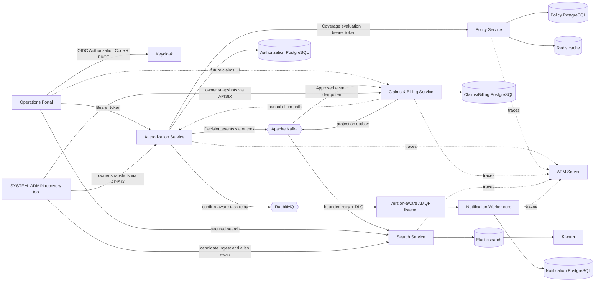

# Teknik Walkthrough: Milestone 0–7

Bu doküman, Milestone 8'e kadar uygulanmış sistemi açıklar. Yaşayan bir teknik anlatıdır: tamamlanan her milestone bu dosyayı, README'yi, mimari diyagramları, demo'yu ve ilgili ekran görüntülerini günceller.

## 1. Portföy hikâyesi

Platform, kurumsal sağlık yazılımı geliştirme deneyiminden modern Java ve React stack'ine geçişi, alttaki domain bilgisini kaybetmeden göstermeyi amaçlar. Bir healthcare provider'ın bir insurer'dan sağlık hizmeti için authorization istemesini, insurer'ın policy coverage kontrolü yapıp karar vermesini ve approved hizmetin claim, invoice, reconciliation ve payment workflow'una dönüşmesini modeller.

Bu, birbirinden bağımsız CRUD ekranlarından oluşan bir koleksiyon değildir. Merkezi değer, invariant ve boundary'lerdedir:

- bir provider başka bir provider'ın record'ları üzerinde işlem yapamaz;
- expired, inactive, mismatched, uncovered, over-limit veya wrong-currency policy pending pre-authorization üretemez;
- yalnızca approved pre-authorization claim başlatabilir;
- decision'lar arbitrary status update değil, legal state transition'lardır;
- invoice overpay edilemez ve yalnızca tamamen ödendiğinde settled olur;
- concurrent decision'lar optimistic locking ile tespit edilir;
- her service kendi database'inin sahibidir ve başka service'in table'ları üzerinden değil API üzerinden iletişim kurar.

## 2. Teslim edilen milestone'lar

### Milestone 0 — Tekrarlanabilir Java 21 temeli

Backend, Dockerfile'lar ve GitHub Actions Java 21 üzerinde hizalandı. Maven Wrapper, Maven çalıştırmasını reproducible tutar. Docker multi-stage build kullanır; böylece runtime image içinde Maven bulunmaz ve final process non-root user olarak çalışır. Spring Boot actuator health endpoint'leri local diagnostic sağlar.

### Milestone 1 — Authorization bounded context

Authorization Service, Clean Architecture etrafında yeniden düzenlendi. `PreAuthorization` aggregate submission ve decision invariant'larının sahibidir. Input port'lar application'ın sunduğu operation'ları, output port'lar ise persistence ve coverage verification ihtiyacını tanımlar. Spring configuration plain application service'leri transactional decorator'larla compose eder. JPA, OAuth2, HTTP ve Spring MVC outer adapter'larda kalır.

Service submission, paginated work-queue search, detail, approval ve rejection sunar. Hospital result'ları authenticated provider ile sınırlandırılır; specialist ve administrator'lar provider'lar arasında query yapabilir. JPA `@Version`, competing decision'ları tespit eder ve bunları conflict response'a map eder.

### Milestone 2 — Operations Portal

Vite, React ve TypeScript application pragmatik bir Feature-Sliced dependency direction kullanır: `app -> pages -> widgets -> features -> entities -> shared`. TanStack Query remote server state'in sahibidir. React Hook Form ve Zod form state ile validation'ın sahibidir. Shared typed client Keycloak access token'ını ekler ve RFC 9457 response'larını UI error'larına çevirir.

Mevcut portal scope bilinçli olarak pre-authorization üzerine odaklanmıştır: dashboard summary card'ları, filter/sort/pagination destekli work queue, submission, detail ve specialist approval/rejection. Role-aware navigation ve control'ler server-side authorization'ı destekler; asla onun yerine geçmez.

### Milestone 3 — Policy bounded context

Policy Service policy validity ve coverage için source of truth haline geldi. Bir policy dated validity, status, member ownership ve bir veya daha fazla coverage definition içerir. Her coverage service code, currency, monetary limit ve covered amount rule'larını korur.

Authorization, pre-authorization persist etmeden önce application output port üzerinden coverage'ı senkron doğrular. REST adapter fail-closed davranır: business denial ve dependency failure pending request oluşturmaz. Bu seçim hospital'a immediate answer verir ve policy rule'larını tek service içinde tutar. Aynı zamanda temporal coupling getirir; ADR-005'te bilinçli trade-off olarak dokümante edilmiştir.

Coverage evaluation read-only eligibility decision'dır. Benefit limit reserve veya consume etmez. Cross-request limit accounting mevcut sistemin gizli iddiası değil, bilinen future domain requirement'ıdır.

### Milestone 4 — Claims and Billing bounded context

Approved bir pre-authorization tek bir claim ve onun invoice'unu başlatabilir. Claims ve billing şu an aynı bounded context içinde yaşar; çünkü adjudication, reconciliation ve payment local transaction gerektirir ve birlikte evolve olur. Bunlar ayrı aggregate root'lardır: `Claim` adjudication'ın, `Invoice` ise payable amount, dispute, payment reference ve settlement'ın sahibidir.

Claim `SUBMITTED` durumundan `UNDER_REVIEW` durumuna, ardından `APPROVED` veya `REJECTED` durumuna geçer. Approval insurer-approved amount'u set eder ve invoice'u reconcile eder. Kısa payment `DISPUTED` üretir; payable amount üzerinde anlaşmak invoice'u `MATCHED` durumuna taşır; payment'lar `SETTLED` olana kadar birikir. Claim rejection unpaid invoice'u void eder. Unique invoice number, pre-authorization reference ve payment reference database-backed replay protection sağlar.

### Milestone 5 — Güvenilir event-driven claim initiation

Authorization versioned decision event'ini aggregate decision ile aynı transaction içinde local outbox'a kaydeder. Scheduled relay event'i Kafka'ya publish eder ve ancak bundan sonra delivered olarak işaretler. Bu küçük pencere içinde crash duplicate üretebilir; bu nedenle Claims/Billing idempotency'yi application contract'ın parçası olarak ele alır: claim, invoice ve `processed_messages` marker tek transaction içinde commit edilir. Approval financial process'i eventually başlatır; rejection durable fact olarak publish edilir ancak Claims/Billing action üretmez.

Broker error'ları outbox row'u sonraki poll için pending bırakır. Consumer failure toplam üç fixed-backoff attempt alır ve ardından DLT'ye taşınır. Multi-step distributed compensation policy olmadığı için Saga eklenmemiştir.

### Milestone 6 — Notification delivery

Notification Worker artık framework-independent delivery aggregate, application use case, repository/sender port'ları ve private PostgreSQL schema'ya sahiptir. `taskId` hem database primary key hem future downstream-provider idempotency key'dir. Delivered replay no-op'tur; received task retryable kalır; aynı task identifier'ın farklı intent için reuse edilmesi contract error olarak reddedilir.

Persistence adapter yalnızca technical identifier'lar, provider reference, notification type, template key, state ve timestamp saklar. Member, policy, diagnosis, email, phone, token veya rendered-content data saklamaz. Liquibase schema'nın sahibidir ve database check constraint'leri aggregate'in state/timestamp invariant'larını yansıtır.

Authorization artık notification work için ikinci, dedicated bir outbox record oluşturur. Pre-authorization decision, Kafka business event ve minimal notification task aynı local transaction'ı paylaşır. PostgreSQL integration testi hem successful three-write commit'i hem de notification task persistence fail olduğunda decision ve iki outbox'ın rollback olduğunu kanıtlar.

Scheduled Authorization adapter pending task row'larını lock eder ve her birini persistent, versioned JSON message'a map eder. Correlated RabbitMQ publisher confirm bekler ve `published_at` set etmeden önce mandatory publisher return'leri kontrol eder; `nack`, timeout, serialization failure ve unroutable result sonraki poll için pending kalır. Durable direct exchange, delivery queue ve dead-letter route code içinde declare edilir. Bu producer behavior'ları unit test edilir. Worker v1 JSON contract'ını framework-free command'a çevirir, transaction-decorated use case'i invoke eder ve yalnızca commit sonrasında manual acknowledge eder. Invalid version ve processing failure requeue olmadan reject edilir. Safe log adapter sender port'u gösterir ama email veya SMS gönderildiğini iddia etmez.

RabbitMQ artık Compose içinde durable direct exchange, delivery queue, dead-letter exchange ve DLQ ile çalışır. Listener yalnızca explicit transient delivery failure'ı retry eder: default olarak bounded exponential backoff ile toplam üç attempt. Contract/version ve invariant failure permanent kabul edilir ve doğrudan DLQ'ya gider. Retry transaction proxy'yi sarar; böylece her attempt yeni transaction başlatır ve yalnızca committed success acknowledge edilir. PostgreSQL/RabbitMQ Testcontainers duplicate suppression ve gerçek dead-letter routing'i kanıtlar; synthetic Compose demo üç decision'ın `DELIVERED` durumuna ulaştığını doğrular.

### Milestone 7 — Cache, search ve observability

Policy'nin application service'i Redis'e değil `CoverageEvaluationCache` port'una bağımlıdır. Aggregate yüklemeden önce cache'e bakar ve result decision'ı 30 saniye saklar. Adapter complete evaluation identity'yi hash'ler; böylece Redis key'leri member veya policy identifier'ını açığa çıkarmaz. Read, write ve invalidation PostgreSQL'e fail-open davranır; yalnızca authoritative dependency failure Authorization'ın unverified request kabul etmesini engeller.

Cross-context operations search yeni bir read-model bounded context'tir. Her Claims/Billing transition aggregate ile aynı transaction içinde complete `ClaimSearchProjection` persist eder. Scheduled relay projection'ı Kafka'ya publish eder; Search Service ayrıca Authorization decision event'lerini consume eder. Her iki contract deterministic Elasticsearch document'larına map edilir. Bu at-least-once idempotency sağlar; Search'e source aggregate'i mutate etme veya impersonate etme hakkı vermez. Hospital query'leri daima signed provider scope ile override edilir.

Portal'ın yeni Search entity/API/page slice'ı port 8084 ile konuşur ve filter ile pagination'ı URL içinde tutar. TanStack Query remote state'in sahibidir. Shared HTTP client `X-Correlation-ID` oluşturur; servlet filter'ları validate edip echo eder, REST client'lar forward eder ve asynchronous listener'lar event/task metadata'dan derive eder. Spring Boot MDC'yi ECS JSON olarak render eder. Docker Elastic Java agent'ı externally attach eder; tracing concern'leri domain veya application code'a girmez.

### Milestone 8 — Gateway security boundary

APISIX host'a publish edilen tek business API origin'dir. Edge'de Keycloak token'larını validate eder ve shared traffic, CORS, payload, timeout, header ve correlation policy'lerini uygular. Her service token'ı doğrulamaya devam eder ve provider/role authorization decision'larının sahibi olmaya devam eder: gateway authentication application authorization'ın yerine geçmez.

### Milestone 9 — Audit ve governance

Audit design service-owned ve append-only'dir. Böylece her business transaction central audit service'e couple olmaz ve audit row, tanımladığı state ile atomik commit olabilir. Authorization submission, approval ve rejection; Policy policy issuance; Claims/Billing ise claim adjudication, invoice reconciliation/void/dispute resolution ve payment record eder. Her application core framework-free `AuditTrail` output port'a bağımlıdır.

Contract controlled action, actor subject/role, provider scope, correlation ID, timestamp, controlled reason code, status delta ve retention class yakalar. Bilinçli olarak business snapshot veya free text kabul edemez. JDBC adapter journal'a yazar; Liquibase update, delete ve truncate'i reddeden database trigger'ları ekler. PostgreSQL Testcontainers hem positive path'i hem fail-closed rollback'i kanıtlar: audit persistence fail olursa governed business mutation ve ilgili outbox'lar rollback olur.

Her service journal'ı için query port, use case, JDBC read adapter ve REST controller'ın sahibidir. Hem controller hem use case `SYSTEM_ADMIN` gerektirir; filter'lar aggregate UUID ve service-local action allowlist ile sınırlandırılır; page size maksimum 100'dür ve ordering timestamp + audit ID kullanır. APISIX üç API'yi route ederken React Audit Trail page tek seferde bir service seçer. Böylece database-per-service ownership korunur: UI unified'dır, data store'lar değildir. Repeatable synthetic demo policy, authorization, claim, invoice ve payment transition'ları için minimum evidence count'larını assert eder.

Retention class'lar yasal period uydurmak yerine handling intent'i tanımlar. Lawful basis, approved duration, disposal job, backup erasure, encryption/key management ve regulatory sign-off açık production responsibility olarak kalır.

### Milestone 10 — Search ve messaging recovery

Elasticsearch açıkça derived state'tir; bu nedenle "rebuildable" artık söz değil executable owner-driven process anlamına gelir. Authorization ve Claims/Billing yalnızca kendi database'leri üzerinde narrow, stable, `SYSTEM_ADMIN` projection-export use case sunar. Local orchestrator iki API'yi APISIX üzerinden page eder ve current snapshot'ları Search'e gönderir; ne Search ne script database credential veya JPA entity alır.

Search versioned physical candidate oluştururken read ve normal event write'ları `healthcare-operations` alias üzerinden devam eder. Ingestion event consumer'ın kullandığı aynı domain record'u validate eder. Activation candidate'ı refresh eder, count'u orchestrator'ın distinct deterministic ID count'u ile karşılaştırır ve alias hâlâ recorded predecessor'ı gösteriyorsa atomik olarak taşır. Predecessor retained kalır; rollback backup restore değil başka bir alias compare-and-swap operation olur.

Deterministic ID tek başına delayed event'in newer snapshot'ı overwrite etmesini engellemez. Bu nedenle event ve export contract'ları owner-defined monotonic `sourceRevision` taşır; Elasticsearch scripted conditional upsert kullanır. Authorization bunu aggregate version'dan türetir; Claims/Billing ise Claim ve Invoice version'larını birleştirir, çünkü ikisi de tek search document'a katkı sağlar. Additive field olmayan legacy document/message revision 1'e map edilir; böylece rebuild bunları replace edene kadar compatibility korunur.

Messaging recovery bilinçli olarak operator-assisted'dır. Status script outbox age/attempt, Kafka group lag ve RabbitMQ depth raporlar; payload göstermez. Kafka DLT ve RabbitMQ DLQ araçları SHA-256/size/routing metadata inspect eder, replay için transient classification ve explicit flag gerektirir, batch/attempt sayılarını sınırlar ve original dead letter'ı koruyarak yalnızca allowlist route'lara copy eder. Idempotent consumer valid duplicate'i güvenli hale getirir; permanent contract error'ı onarmaz.

## 3. Runtime mimarisi

Mevcut service-to-service call'lar caller'ın access token'ını relay eder. Böylece receiving service içinde end-user authorization ve provider ownership korunur. Production deployment token exchange veya workload identity kullanabilir; bu değişiklik ayrı bir trust-model kararı gerektirir.

## 4. Clean Architecture üzerinden request akışı

Tipik bir command için:

1. REST controller transport request'i validate eder ve JWT claim'lerini application `ActorContext` modeline map eder.
2. Controller persistence'a doğrudan gitmek yerine input port invoke eder.
3. Transactional decorator application layer'a Spring annotation koymadan unit-of-work boundary'yi tanımlar.
4. Application service authorization kontrolü yapar, aggregate'i coordinate eder ve output port'ları çağırır.
5. Aggregate/value object'ler state ve monetary invariant'ları uygular.
6. Infrastructure adapter'lar domain object'leri ile JPA entity veya remote HTTP representation'lar arasında translation yapar.
7. Exception advice RFC 9457 Problem Details response döndürür.

Query'ler dedicated input ve output model kullanır. Bu lightweight CQRS'dir: read ve write use case'leri açıktır ancak sistem ayrı read database tutmaz.

## 5. Domain modeli ve invariant'lar

### Authorization

- `PreAuthorization` aggregate root'tur.
- `Money` negative value ve mismatched currency operation'larını engeller.
- `PENDING -> APPROVED|REJECTED` tek decision transition'lardır.
- İkinci decision domain level'da reddedilir; concurrent stale write persistence-level optimistic locking ile reddedilir.
- Provider ownership yalnızca trusted token içindeki `provider_id` değerinden gelir.

### Policy

- `Policy` aggregate root'tur ve coverage collection'ın sahibidir.
- Validity inclusive'dir ve injected `Clock` ile evaluate edilir.
- Coverage grant edilmesi için member, status, date, service code, currency ve maximum amount'ın tamamı eşleşmelidir.
- Policy data Policy Service'e özeldir.

### Claims and billing

- `Claim` ve `Invoice` ayrı aggregate root'tur; aynı bounded context'i paylaşır ve gerektiğinde aynı transaction'ı kullanır.
- Bir claim tek approved pre-authorization ve tek invoice ile ilişkilidir.
- Approved amount invoiced amount'u aşamaz.
- Payment amount positive olmalıdır; cumulative payment payable amount'u aşamaz; payment reference unique'dir.
- Provider-scoped read'ler cross-tenant disclosure'ı engeller.

Detaylı relationship ve message order için [Data model](architecture/data-model.md) ve [workflow sequence'leri](architecture/workflow-sequences.md) dosyalarına bakın.

## 6. Security modeli

Keycloak user'ları authenticate eder. Her API issuer, signature, expiry ve realm role'leri OAuth2 resource server olarak validate eder. Uygulanmış role'ler:

| Role | Mevcut sorumluluk |
| --- | --- |
| `HOSPITAL_USER` | Provider-owned pre-authorization ve claim gönderme/okuma |
| `INSURANCE_SPECIALIST` | Pre-authorization kararları ve reconciliation/payment |
| `CLAIM_APPROVER` | Claim review, approval ve rejection |
| `SYSTEM_ADMIN` | Administrative read ve policy/reconciliation authority |

Authorization tasarım gereği iki yerde bulunur: controller annotation'ları invalid endpoint access'i erken reddeder; application service aynı business authority'yi HTTP'den bağımsız enforce eder. Hospital user ayrıca UUID `provider_id` token claim gerektirir. Request body provider identity seçemez.

Imported realm `providerId` değerini managed Keycloak user-profile attribute olarak declare eder. User görebilir ancak yalnızca administrator edit edebilir. Public PKCE client bunu signed `provider_id` claim'e map eder; undeclared custom attribute'a güvenmek başarısız olur çünkü Keycloak 26 unmanaged attribute'ları default olarak ignore eder.

Repository gerçek patient data veya credential içermez. Demo identifier'lar sentetik UUID'dir; credential ve token yalnızca runtime environment variable olarak kalır. Log ve error'lar token veya health information içermemelidir.

## 7. Persistence ve consistency

State sahibi her backend component bağımsız Liquibase changelog'a sahiptir. Üç API service ve Notification Worker Compose içinde dört private PostgreSQL 17 database kullanır. RabbitMQ transport'tur, domain ownership source'u değildir; producer outbox ve worker delivery table durable intent/outcome tutar. JPA entity'leri domain model'den ayrı persistence representation'lardır. Böylece domain içinde Spring/JPA annotation bulunmaz ve mapping adapter boundary'de evolve olabilir.

Transaction input port çevresinde infrastructure decorator'larda yer alır. `@Version` mutable aggregate row'larını korur. Unique constraint'ler stable business reference'ları duplicate submission'a karşı korur. Transactional outbox local ACID boundary'yi durable intent-to-publish seviyesine uzatır; PostgreSQL ve Kafka'nın tek transaction paylaştığını iddia etmez. Delivery at-least-once kalır; consumer inbox ve business-key constraint'leri replay'i güvenli hale getirir.

## 8. Error semantics ve resilience

API'ler validation, authentication/authorization, not-found, business conflict ve dependency error için RFC 9457 Problem Details kullanır. Synchronous validation call'ları fail-closed'dur ve explicit timeout kullanır. Kafka consumption bounded retry ve DLT recovery kullanır; outbox publication sonraki scheduled poll'larda retry edilir. RabbitMQ consumption transient ve permanent failure'ı classify eder, her transient attempt'e fresh transaction verir ve exhausted/permanent work'ü dead-letter eder. Synchronous HTTP dependency'ler için circuit breaker henüz uygulanmamıştır.

## 9. Test stratejisi ve evidence

Backend test portföyü framework-free domain/application unit test, MVC/security slice test, Spring bean-wiring test, ArchUnit dependency test ve PostgreSQL Testcontainers integration/concurrency test'lerini içerir. Kafka test'leri official Apache Kafka Testcontainer kullanarak duplicate delivery ve poison-message DLT behavior'ını kanıtlar. Frontend Vitest, Testing Library ve FSD import direction architecture test'leri kullanır; ayrıca linting ve production TypeScript/Vite build vardır.

8 Eylül 2026'da Milestone 5 checkpoint Java 21.0.8 ve Docker Desktop 28.5.1 üzerinde doğrulandı. Üç Maven suite toplam 109 passing test içeriyordu: Authorization 50, Policy 21, Claims/Billing 38. Portal oxlint, 5 file içindeki tüm 6 Vitest test ve production TypeScript/Vite build'den geçti. Bu sayılar dated evidence'dır; kalıcı garanti değildir. Fresh checkout için README'deki command'lar source of truth'tur.

Notification Worker suite domain, application, persistence, architecture, configuration, retry/acknowledgement ve real-broker behavior'ı kapsar. Integration test'leri in-memory substitute yerine PostgreSQL 17 ve RabbitMQ 4.1 container kullanır. Duplicate message'ın tek `DELIVERED` row ürettiğini ve unsupported version'ın gerçek DLQ'da quarantine edildiğini kanıtlar. 8 Eylül 2026'da dört backend suite toplam 141 testten geçti: Authorization 59, Policy 21, Claims/Billing 38, Notification Worker 23.
Authorization artık 59 passing test içerir; bunlara multi-write decision transaction için iki full-context PostgreSQL test ve beş AMQP relay/topology unit test dahildir. Sonuncular positive/nack/unroutable outcome, safe persistent message metadata ve durable dead-letter routing'i live broker iddiası olmadan doğrular.

10 Eylül 2026'da Milestone 10 quality gate **193 backend test** ile geçti: Authorization 73, Policy 33, Claims/Billing 51, Notification Worker 23 ve Search Service 13. Yeni proof gerçek PostgreSQL owner-export query'leri, application authorization/bound, conditional stale-revision handling, legacy-document compatibility, count-gated activation, atomic alias swap ve Elasticsearch 9.5.3 üzerinde retained-index rollback'i kapsar. Portal oxlint, 8 file içinde 9 Vitest test ve production build'den geçti. Live Compose rehearsal 70 distinct current projection activate ederken 55-document v1 predecessor'ı retained tuttu.

Documentation'ın kendi executable quality gate'i vardır. Local Markdown link'lerini validate eder, Keycloak ve demo JSON'u parse eder, PowerShell demo ve recovery script'lerini parse eder, beklenen on bir PNG file'ı doğrular ve her Mermaid block'u Mermaid CLI ile render eder. Böylece sonraki milestone'lar implementation'ı değiştirirken diagram veya portfolio link'in sessizce bozulması engellenir.

## 10. Delivery ve local operations

Docker Compose Keycloak, APISIX, Kafka, RabbitMQ, Redis, dört API service, Notification Worker, dört private database, Elasticsearch, Kibana ve APM Server çalıştırır.
Gerekli credential'lar ignore edilen `.env` üzerinden sağlanır; `.env.example` safe template'tir. Health check'ler database-dependent startup sırasını kontrol eder. GitHub Actions backend service'leri ve operations portal'ı Java 21 ve Node ile bağımsız test eder.

APISIX file-driven data plane'dir: local topology için etcd veya mutable Admin API gerekmez. External bearer token'ları authenticate eder, traffic policy uygular ve unpublished Spring port'larına route eder. Bilinçli olarak provider veya aggregate authorization'ın sahibi değildir; Spring token validation'ı tekrarlar ve application layer bu business rule'ları enforce eder. Gateway-native error'lar upstream business error'larını rewrite etmeden RFC 9457'ye adapt edilir.

Realm bearer-only `health-insurance-api` audience client declare eder. Keycloak portal ve demo access token'larına bu audience'ı ekler; APISIX exact audience match ister. Böylece token realm için cryptographically valid olsa bile başka resource için issue edildiyse reddedilebilir.

Milestone 11, yedi stateless workload için Kubernetes-native Kustomize base ve local overlay ekler. Baseline non-root execution, read-only root filesystem, dropped Linux capability, RuntimeDefault seccomp, resource bound, startup/readiness/liveness probe, graceful termination, rolling update, topology spread, PDB, HPA, mounted API token olmadan dedicated ServiceAccount ve default-deny NetworkPolicy enforce eder. Stateful platform'lar external contract olarak kalır; çünkü production operation vendor/operator, storage, backup ve recovery kararı gerektirir ve birkaç portfolio YAML file ile dürüstçe encode edilemez. ADR-013 bu boundary'yi kaydeder.

Local apply script ignore edilen `.env` üzerinden Kubernetes Secret'ları memory içinde materialize eder; repository yalnızca name ve example içerir, value içermez. Base/local render validator workload count, security context, availability control, network isolation ve credential policy'yi kontrol eder. Container image'lar local build edilmiştir. Milestone 12 daha sonra bu package'ı disposable Minikube cluster içinde çalıştırmıştır: yedi Argo CD control-plane pod'un tamamı Ready olmuş ve staging Application server-side sync'i tamamlamıştır. Application health `Progressing` kalmıştır; çünkü production-owned dependency ve Secret'lar bilinçli olarak external'dır, manifest delivery fail olduğu için değil.

## 11. .NET'ten Java'ya eşleme

| Tanıdık .NET kavramı | Mevcut proje karşılığı |
| --- | --- |
| ASP.NET Core Controller | Spring MVC REST controller |
| ASP.NET Core DI | Spring IoC configuration ve bean'ler |
| EF Core entity/configuration | JPA entity ve repository adapter |
| `DbContext` transaction | Spring `@Transactional` decorator |
| FluentValidation/data annotations | Bean Validation + browser'da Zod |
| ASP.NET authentication handler | Spring Security OAuth2 resource server |
| Authorization policy | `@PreAuthorize` + application authorization |
| ProblemDetails | RFC 9457 Spring `ProblemDetail` response |
| NuGet/MSBuild | Maven Wrapper |
| React query/service hook | TanStack Query feature hook |
| `appsettings.json` | `application.yml` ve environment variable |
| EF concurrency token | JPA `@Version` |
| EF Core transactional outbox table | JPA outbox adapter + scheduled relay |
| MassTransit consumer/error transport | Spring Kafka listener + DLT veya Spring AMQP listener + DLQ |
| EF Core persistence adapter | Notification JPA entity + repository adapter |
| `IDistributedCache` adapter | Explicit fallback'lı Redis-backed cache output port |
| Elasticsearch .NET client/read model | Elastic Java Client projection adapter |
| Serilog ECS + `LogContext` | Spring Boot ECS logging + SLF4J MDC |
| Application Insights/OpenTelemetry auto-instrumentation | Externally attached Elastic APM Java agent |
| ASP.NET Core reverse proxy / YARP | APISIX declarative route ve edge plugin |
| EF Core `RowVersion` read model'e taşınması | Projection `sourceRevision`'a map edilen JPA aggregate revision |
| Elasticsearch alias reindex/blue-green read model | Versioned candidate + atomic alias compare-and-swap |
| MassTransit error queue recovery tool | Bounded Kafka DLT / RabbitMQ DLQ inspect-classify-copy script'leri |

## 12. Mülakat açıklaması

### İki dakikalık versiyon

“Generic CRUD yerine gerçekçi bir healthcare insurance flow modelledim. Sistemde Authorization, Policy ve Claims/Billing bounded context'leri var; her biri kendi PostgreSQL database'ine ve Clean Architecture boundary'lerine sahip. Keycloak authentication'ı yönetiyor; role ve provider ownership hem HTTP hem application level'da enforce ediliyor. Policy eligibility synchronous çünkü submission immediate answer gerektiriyor. Aggregate decision ve outbox event aynı transaction'da commit oluyor; Kafka daha sonra Claims/Billing'i retry/DLT destekli idempotent consumer üzerinden başlatıyor. Aggregate'ler state ve money rule'larını koruyor, Liquibase her schema'yı version'luyor ve optimistic locking concurrent double decision'ı engelliyor. React/TypeScript portal Feature-Sliced boundary ve server state için TanStack Query kullanıyor. Redis coverage read'lerini accelerate ediyor ama authoritative olmuyor; Kafka-backed outbox'lar provider-scoped Elasticsearch read model oluşturuyor. ECS log'ları, correlation propagation ve Elastic APM synchronous ve asynchronous path'leri diagnose edilebilir hale getiriyor. Test'ler domain rule, security, architecture, persistence, concurrency, cache failure ve gerçek search infrastructure'ını kapsıyor.”

“Elasticsearch disposable olduğu için, service database'lerini okumak veya Kafka retention'ın complete olduğunu varsaymak yerine bounded source-owner snapshot'lardan zero-downtime rebuild path ekledim. Candidate index count-validate ediliyor ve atomic alias compare-and-swap ile activate ediliyor; predecessor rollback için tutuluyor. Monotonic owner revision stale event'in yeni snapshot'ı geriletmesini engelliyor. Dead-letter recovery de explicit ve bounded: safe metadata inspect ediliyor, classify ediliyor ve yalnızca transient failure copy-replay edilirken idempotency duplicate'i koruyor.”

“Portal dört published service port yerine tek APISIX origin'e gidiyor. Gateway Keycloak JWT'lerini JWKS ile validate ediyor ve rate, CORS, body-size, timeout ve correlation policy'lerinin sahibi. Spring Security ve application authorization'ı arkasında korudum; çünkü gateway traffic'i authenticate edebilir ama provider-scoped domain decision'ın sahibi olmamalı. Bu duplicated business logic değil, defense in depth.”

### Beklenebilecek sorular

- Claims ve Billing neden tek service ama iki aggregate?
- Policy evaluation neden synchronous ve nasıl fail olur?
- Provider ownership olmadan yalnızca role check neden yetersiz?
- JPA entity ile domain entity neden ayrıldı?
- Optimistic locking neyi korur, neyi korumaz?
- Application layer framework-free ise transaction boundary nerede?
- Bu CQRS mi, ayrı read database neden yok?
- Outbox neden exactly-once yerine at-least-once delivery sağlar?
- Kafka offset tutarken neden processed-message table yine gerekli?
- Broker acknowledgement sonrasında ama `published_at` commit edilmeden önce ne olur?
- Benefit consumption current read-only evaluation'dan nasıl farklı olurdu?
- Kafka ve RabbitMQ neden farklı sorumluluklar için kullanılıyor?
- Retry neden transaction decorator'ın dışında, tek transaction içinde değil?
- Hangi notification error'ları retry'ı bypass edip doğrudan DLQ'ya gitmeli?
- Redis neden fail-open, Policy Service failure neden fail-closed?
- Elasticsearch neden source of truth değil projection?
- Search projection dual-write inconsistency'yi nasıl engelliyor?
- Correlation ID neyi kanıtlar, neyi kanıtlamaz?
- APM agent neden code dependency yerine externally attach ediliyor?
- APISIX standalone mode neden etcd ve Admin API yerine tercih edildi?
- Hangi rule gateway'e, hangisi application use case'e ait?
- Aynı JWT neden hem APISIX hem Spring Security'de validate ediliyor?
- Local rate counter neden birden fazla APISIX replica için yetersiz?
- Kafka replay neden tek Elasticsearch rebuild source'u olarak yetersiz?
- Rebuild in-place yerine neden alias ve retained predecessor kullanılıyor?
- Deterministic document ID'nin kapatamadığı hangi race'i `sourceRevision` kapatır?
- Activation count check öncesi Elasticsearch neden refresh edilmeli?
- Alias compare-and-swap iki operator'ın update kaybetmesini nasıl engeller?
- Dead-letter replay neden manual, classified, bounded ve copy-based?
- Local recovery design'ın hangi parçaları production scale'da değişmeli?

## 13. Mevcut bilinen gap'ler

- Portal'da henüz policy, claim, invoice veya payment screen yok; bu flow'lar API seed script ile gösteriliyor.
- Coverage evaluation request'ler arasında policy limit reserve veya consume etmiyor.
- Service-to-service authentication user token relay ediyor; workload identity veya token exchange yok.
- Synchronous dependency'lerde henüz circuit breaker veya controlled retry yok.
- Outbox retention otomatik değil. Local'da bounded DLT/DLQ inspection ve reviewed copy-replay var; fakat durable authorized/audited control plane yok.
- Authorization search şu anda decision'ları project ediyor; pending item'lar strongly consistent Authorization work queue kullanıyor.
- Search rebuild executable; restart-resumable checkpoint, cancellation, index lifecycle cleanup, workload identity ve multi-operator coordination uygulanmadı.
- ECS log'ları stdout'a yazılıyor ancak production log shipper, redaction policy, dashboard, alert ve retention policy henüz configure edilmedi.
- Demo user'lar local oluşturulmalı; credential asla commit edilmiyor.
- Data classification, audit minimization, service-owned write coverage ve privileged bounded read'ler uygulanmış durumda. Approved retention duration, disposal job, backup erasure, encryption/key management, privileged access için SIEM monitoring ve regulatory sign-off eksik.
- Local APISIX-to-Keycloak discovery HTTP kullanıyor; production trusted TLS gerektirir.
- Rate-limit state gateway instance başına; scaled topology shared Redis counter veya açıkça kabul edilmiş per-instance quota gerektirir.
- Kubernetes live-cluster rollout, trusted ingress TLS, external secret controller/workload identity, Metrics Server-backed HPA observation ve production stateful-service operator'ları environment-specific work olarak kalır.

Notification persistence, transactionally recorded producer intent, confirm-aware relay, durable queue/DLQ topology, classified bounded retry, manual acknowledgement, real-broker integration proof ve Compose-backed end-to-end demo tamamlandı. Local sender bilinçli olarak yalnızca safe metadata loglar; contact resolution ve external email/SMS provider sonraki security ve vendor-boundary kararını gerektirir.

## Milestone 12 — CI/CD ve software supply chain

Delivery workflow artık verification, artifact publication ve GitOps deployment'ı ayırır. Jenkins Azure DevOps/TFS build pipeline'a; Nexus private NuGet feed'e; Harbor private container registry'ye; SonarQube blocking code-quality policy'ye; Argo CD ise pull-based deployment controller'a karşılık gelir. Merkezi trace key, Harbor ve Kustomize tarafından kullanılan full Git SHA'dır.

Önemli trade-off scope honesty'dir. Local environment toolchain ve control flow'u kanıtlar; production HA, enterprise secret management, signed provenance veya fully provisioned dependency platform iddiasında bulunmaz.
