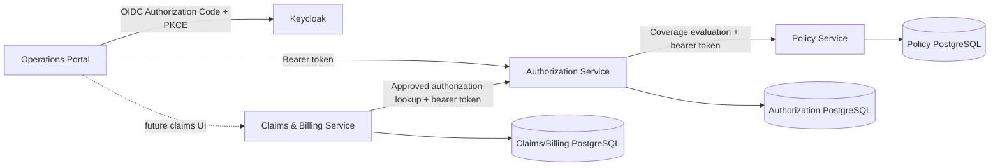

# Technical Walkthrough: Milestones 0–4

This document explains the implemented system as of Milestone 4. It is a living
technical narrative: every completed milestone must update it, the README, the
architecture diagrams, the demo, and relevant screenshots. Milestone 5 and its
event-driven components are intentionally outside the current implementation.

## 1. Portfolio story

The platform demonstrates a move from enterprise healthcare development into a
modern Java and React stack without discarding the underlying domain knowledge.
It models a provider asking an insurer to authorize a healthcare service, the
insurer checking policy coverage and making a decision, and an approved service
becoming a claim, invoice, reconciliation, and payment workflow.

This is not a collection of independent CRUD screens. The central value is in
the invariants and boundaries:

- a provider cannot act on another provider's records;
- an expired, inactive, mismatched, uncovered, over-limit, or wrong-currency
  policy cannot produce a pending pre-authorization;
- only an approved pre-authorization can start a claim;
- decisions are legal state transitions, not arbitrary status updates;
- an invoice cannot be overpaid and only becomes settled when fully paid;
- concurrent decisions are detected using optimistic locking;
- each service owns its database and communicates through an API, never through
  another service's tables.

## 2. Delivered milestones

### Milestone 0 — Reproducible Java 21 foundation

The backend, Dockerfiles, and GitHub Actions were aligned on Java 21. Maven
Wrapper keeps Maven execution reproducible. Docker uses multi-stage builds so
Maven is absent from the runtime image, and the final process runs as a
non-root user. Spring Boot actuator health endpoints support local diagnostics.

### Milestone 1 — Authorization bounded context

The Authorization Service was reorganized around Clean Architecture. The
`PreAuthorization` aggregate owns submission and decision invariants. Input
ports describe the operations that the application offers; output ports
describe persistence and coverage verification needs. Spring configuration
composes plain application services with transactional decorators. JPA, OAuth2,
HTTP, and Spring MVC stay in outer adapters.

The service offers submission, paginated work-queue search, detail, approval,
and rejection. Hospital results are restricted by the authenticated provider;
specialists and administrators can query across providers. JPA `@Version`
detects competing decisions and maps them to a conflict response.

### Milestone 2 — Operations portal

The Vite, React, and TypeScript application uses a pragmatic Feature-Sliced
dependency direction: `app -> pages -> widgets -> features -> entities ->
shared`. TanStack Query owns remote server state. React Hook Form and Zod own
form state and validation. A shared typed client attaches the Keycloak access
token and translates RFC 9457 responses into UI errors.

The current portal scope is intentionally focused on pre-authorizations:
dashboard summary cards, a filterable/sortable/paginated work queue, submission,
detail, and specialist approval/rejection. Role-aware navigation and controls
supplement server-side authorization; they never replace it.

### Milestone 3 — Policy bounded context

The Policy Service became the source of truth for policy validity and coverage.
A policy contains dated validity, status, member ownership, and one or more
coverage definitions. Each coverage protects service code, currency, monetary
limit, and covered amount rules.

Authorization verifies coverage synchronously through an application output
port before it stores a pre-authorization. The REST adapter is fail-closed:
business denial and dependency failure do not create a pending request. This
choice gives the hospital an immediate answer and keeps policy rules in one
service. It also introduces temporal coupling, documented as a conscious
trade-off in ADR-005.

Coverage evaluation is a read-only eligibility decision. It does not reserve
or consume a benefit limit. Cross-request limit accounting is therefore a
known future domain requirement rather than a hidden claim of the current
system.

### Milestone 4 — Claims and Billing bounded context

An approved pre-authorization can start one claim and its invoice. Claims and
billing live in one bounded context for now because adjudication, reconciliation,
and payment require a local transaction and evolve together. They are separate
aggregate roots: `Claim` owns adjudication; `Invoice` owns payable amount,
disputes, payment references, and settlement.

Claims move from `SUBMITTED` to `UNDER_REVIEW`, then to `APPROVED` or
`REJECTED`. Approval sets the insurer-approved amount and reconciles the
invoice. A short payment produces `DISPUTED`; agreeing a payable amount moves it
to `MATCHED`; payments accumulate until `SETTLED`. Rejecting a claim voids an
unpaid invoice. Unique invoice numbers, pre-authorization references, and
payment references add database-backed replay protection.

## 3. Architecture at runtime

The current service-to-service calls relay the caller's access token. This
preserves end-user authorization and provider ownership in the receiving
service. A production deployment may use token exchange or workload identity;
that change requires a separate trust-model decision.

## 4. Request path through Clean Architecture

For a typical command:

1. A REST controller validates the transport request and maps JWT claims to an
   application `ActorContext`.
2. The controller invokes an input port rather than persistence directly.
3. A transactional decorator defines the unit-of-work boundary without placing
   Spring annotations in the application layer.
4. The application service checks authorization, coordinates the aggregate,
   and calls output ports.
5. The aggregate/value objects enforce state and monetary invariants.
6. Infrastructure adapters translate between domain objects and JPA entities or
   remote HTTP representations.
7. The exception advice returns an RFC 9457 Problem Details response.

Queries use dedicated input and output models. This is lightweight CQRS: read
and write use cases are explicit, but the system does not maintain a separate
read database.

## 5. Domain model and invariants

### Authorization

- `PreAuthorization` is the aggregate root.
- `Money` prevents negative values and mismatched currency operations.
- `PENDING -> APPROVED|REJECTED` are the only decision transitions.
- A second decision is rejected at the domain level; a concurrent stale write
  is rejected by persistence-level optimistic locking.
- Provider ownership comes only from `provider_id` in the trusted token.

### Policy

- `Policy` is the aggregate root and owns its coverage collection.
- Validity is inclusive and evaluated against an injected `Clock`.
- Member, status, date, service code, currency, and maximum amount must all
  match for coverage to be granted.
- Policy data is private to the Policy Service.

### Claims and billing

- `Claim` and `Invoice` are separate aggregate roots sharing one bounded
  context and transaction where necessary.
- A claim is linked to one approved pre-authorization and one invoice.
- Approved amount cannot exceed the invoiced amount.
- Payment amount must be positive; cumulative payments cannot exceed payable
  amount; payment reference is unique.
- Provider-scoped reads prevent cross-tenant disclosure.

See [Data model](architecture/data-model.md) and
[workflow sequences](architecture/workflow-sequences.md) for the detailed
relationships and message order.

## 6. Security model

Keycloak authenticates users. Each API validates issuer, signature, expiry, and
realm roles as an OAuth2 resource server. The implemented roles are:

| Role | Current responsibility |
| --- | --- |
| `HOSPITAL_USER` | Submit/read provider-owned pre-authorizations and claims |
| `INSURANCE_SPECIALIST` | Decide pre-authorizations and perform reconciliation/payments |
| `CLAIM_APPROVER` | Review, approve, or reject claims |
| `SYSTEM_ADMIN` | Administrative read and policy/reconciliation authority |

Authorization exists twice by design: controller annotations reject invalid
endpoint access early, while application services enforce the same business
authority independent of HTTP. Hospital users additionally require a UUID
`provider_id` token claim. Request bodies never select the provider identity.

The imported realm declares `providerId` as a managed Keycloak user-profile
attribute. Users may view it but only administrators may edit it. The public
PKCE client maps it into the signed `provider_id` claim; relying on an
undeclared custom attribute would fail because Keycloak 26 ignores unmanaged
attributes by default.

The repository contains no real patient data or credentials. Demo identifiers
are synthetic UUIDs; credentials and tokens remain runtime-only environment
variables. Logs and errors must not include tokens or health information.

## 7. Persistence and consistency

Each service has a PostgreSQL 17 database and an independent Liquibase changelog.
JPA entities are persistence representations, separate from the domain model.
This avoids Spring/JPA annotations in the domain and lets mappings evolve at the
adapter boundary.

Transactions are placed around input ports in infrastructure decorators.
`@Version` protects mutable aggregate rows. Unique constraints protect stable
business references against duplicate submission. These mechanisms solve local
ACID consistency only. Atomic event publication across services is deliberately
deferred to Milestone 5's transactional outbox design.

## 8. Error semantics and resilience

APIs use RFC 9457 Problem Details for validation, authentication/authorization,
not-found, business conflict, and dependency errors. Synchronous validation
calls are fail-closed and use explicit timeouts. Retry and circuit-breaker
policies are not yet implemented; blindly retrying non-idempotent commands would
be unsafe. This is a documented limitation, not an implied capability.

## 9. Test strategy and evidence

The backend test portfolio contains framework-free domain/application unit
tests, MVC/security slice tests, Spring bean-wiring tests, ArchUnit dependency
tests, and PostgreSQL Testcontainers integration/concurrency tests. The frontend
uses Vitest, Testing Library, and architecture tests for FSD import direction,
plus linting and a production TypeScript/Vite build.

On 4 September 2026, the Milestone 4 checkpoint was reverified on Java 21.0.8
and Docker Desktop 28.5.1. The three Maven suites contained 102 passing tests:
Authorization 46, Policy 21, and Claims/Billing 35. The portal passed oxlint,
all 6 Vitest tests in 5 files, and the production TypeScript/Vite build. Treat
these numbers as dated evidence, not a permanent guarantee; the commands in the
README are the source of truth for a fresh checkout.

The documentation has its own executable quality gate. It validates local
Markdown links, parses the Keycloak and demo JSON, parses the PowerShell demo
scripts, verifies the five expected PNG files, and renders all 19 Mermaid blocks
with Mermaid CLI. This prevents a diagram or portfolio link from silently
rotting while later milestones change the implementation.

## 10. Delivery and local operations

Docker Compose runs Keycloak, three services, and three private databases.
Required credentials are supplied from an ignored `.env`, using `.env.example`
as a safe template. Health checks order database-dependent startup. GitHub
Actions independently tests backend services and the operations portal using
Java 21 and Node.

The repository does not yet contain Kubernetes, APISIX, Jenkins, SonarQube,
Nexus, Harbor, Argo CD, Redis, Kafka, RabbitMQ, Elasticsearch, Kibana, or Elastic
APM implementations. Those remain planned milestones and will only be added
when they solve an explicit operational or domain problem.

## 11. .NET-to-Java mapping

| Familiar .NET concept | Current project equivalent |
| --- | --- |
| ASP.NET Core Controller | Spring MVC REST controller |
| ASP.NET Core DI | Spring IoC configuration and beans |
| EF Core entity/configuration | JPA entity and repository adapter |
| `DbContext` transaction | Spring `@Transactional` decorator |
| FluentValidation/data annotations | Bean Validation + Zod in the browser |
| ASP.NET authentication handler | Spring Security OAuth2 resource server |
| Authorization policy | `@PreAuthorize` plus application authorization |
| ProblemDetails | RFC 9457 Spring `ProblemDetail` response |
| NuGet/MSBuild | Maven Wrapper |
| React query/service hooks | TanStack Query feature hooks |
| `appsettings.json` | `application.yml` and environment variables |
| EF concurrency token | JPA `@Version` |

## 12. Interview explanation

### Two-minute version

“I modeled a realistic healthcare insurance flow rather than generic CRUD. The
system has Authorization, Policy, and Claims/Billing bounded contexts, each with
its own PostgreSQL database and Clean Architecture boundaries. Keycloak handles
authentication, while roles and provider ownership are enforced at both HTTP
and application levels. Policy eligibility and approved-authorization checks
are synchronous today because the caller needs an immediate answer. Aggregates
protect state and money rules, Liquibase versions each schema, and optimistic
locking prevents concurrent double decisions. A React/TypeScript portal uses
Feature-Sliced boundaries and TanStack Query for server state. Tests cover
domain rules, security, architecture, persistence, and concurrency.”

### Questions to expect

- Why are Claims and Billing one service but two aggregates?
- Why is policy evaluation synchronous, and how does it fail?
- Why is role checking insufficient without provider ownership?
- Why separate JPA entities from domain entities?
- What does optimistic locking protect, and what does it not protect?
- Where is the transaction boundary if the application layer is framework-free?
- Is this CQRS, and why is there no separate read database?
- How would an outbox change claim approval in Milestone 5?
- How would benefit consumption differ from the current read-only evaluation?
- Why use Kafka and RabbitMQ for different responsibilities later?

## 13. Known gaps before Milestone 5

- The portal has no policy, claim, invoice, or payment screens yet; those flows
  are demonstrated through the API seed script.
- Coverage evaluation does not reserve or consume policy limits across requests.
- Service-to-service authentication relays the user token and has no workload
  identity or token exchange.
- Synchronous dependencies do not yet use circuit breakers or controlled retry.
- There is no transactional outbox, event broker, idempotent consumer, or DLQ.
- Demo users must be created locally because credentials are never committed.
- Production-grade consent, PHI classification, encryption/key management,
  retention, audit trail, and regulatory controls require explicit design.

Milestone 5 must not begin until it is explicitly authorized. Its first design
decision will define integration-event contracts, outbox ownership, delivery
semantics, and consumer idempotency without weakening current aggregate and
database boundaries.
