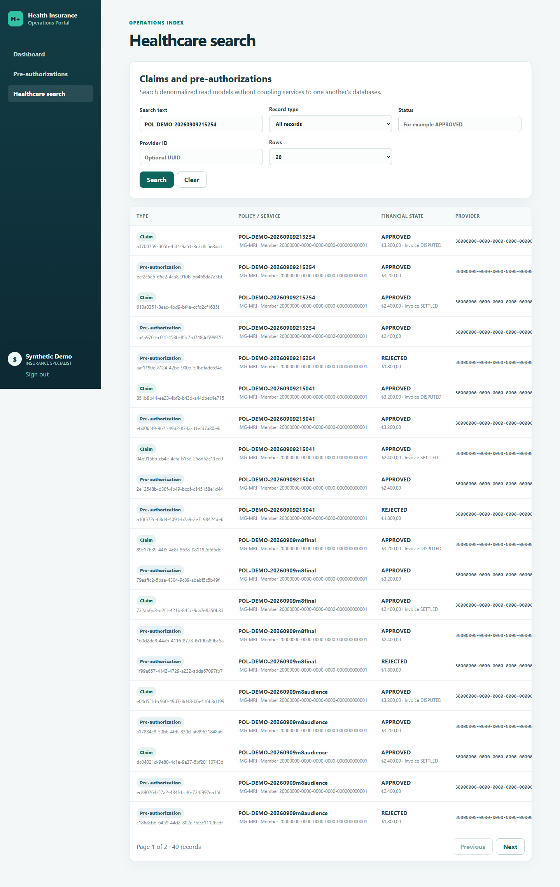
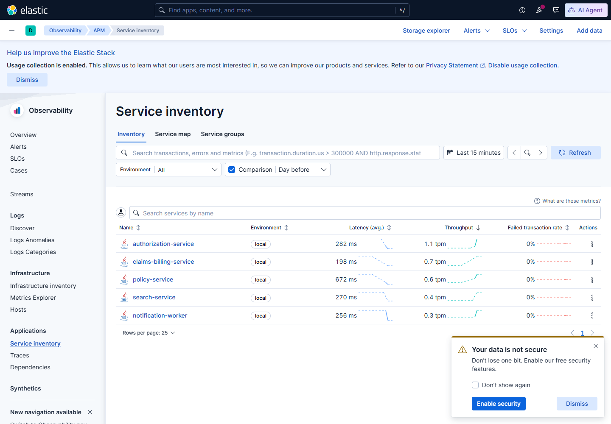
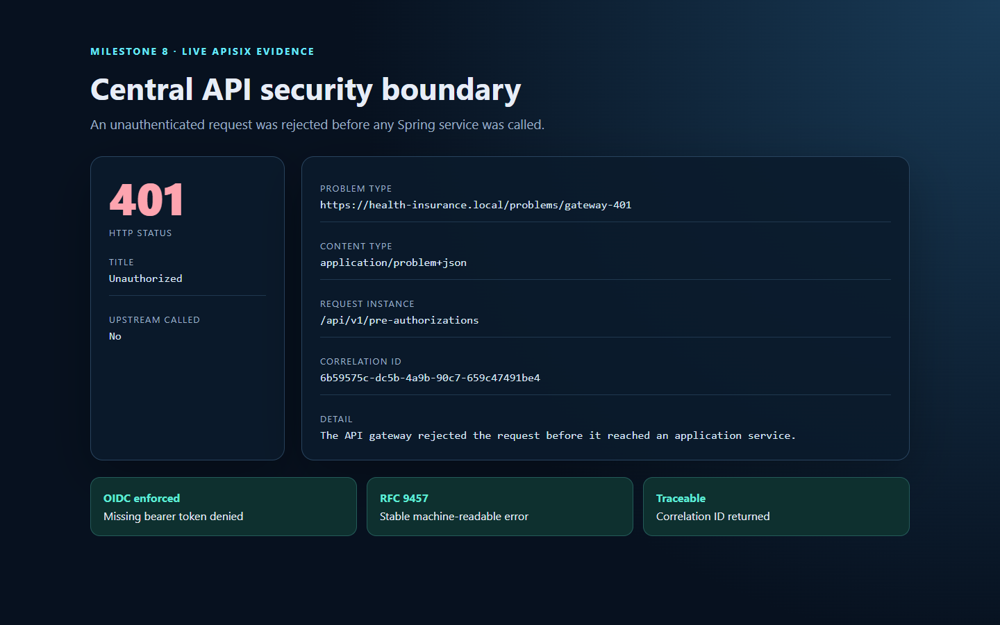
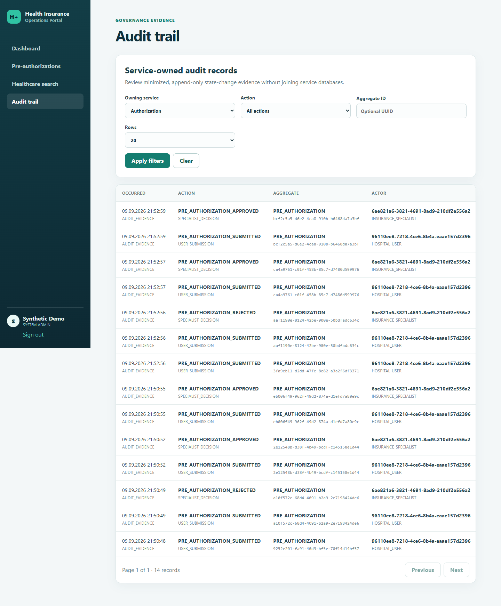

# Screenshot Catalogue

This directory contains milestone checkpoint images captured from the running
operations portal with synthetic demo identifiers. It must never contain access
tokens, credentials, real patient information, or real provider data.

The portal implements pre-authorization operations, cross-context search, and a
privileged service-owned audit view. Policy and Claims/Billing command workflows
are demonstrated through the API script until their operational screens are
implemented in a later milestone.

Screenshots retained through the Milestone 9 documentation checkpoint:

- `01-dashboard.png` — role-aware landing page and operational summary.
- `02-pre-authorization-work-queue.png` — filter, sort, and pagination UI.
- `03-submit-pre-authorization.png` — validated hospital submission form.
- `04-pre-authorization-detail.png` — request detail and status information.
- `05-specialist-decision.png` — specialist approval/rejection controls.
- `06-rabbitmq-notification-queues.png` — live durable delivery queue, DLX/DLK
  arguments, DLQ, consumer processing state, and drained message counts.
- `07-healthcare-search.png` — secured Elasticsearch-backed cross-context
  operations query using synthetic policy and financial records.
- `08-kibana-apm-services.png` — live Kibana APM services inventory populated by
  externally attached Java agents.
- `09-apisix-gateway-problem-details.png` — live unauthenticated gateway
  rejection rendered as RFC 9457 JSON with a correlation ID; the executable
  demo separately verifies the non-visual wrong-audience rejection.
- `10-audit-trail.png` — `SYSTEM_ADMIN`-only service selector, bounded filters,
  paginated minimized state-change evidence, actor context, and correlation ID.

## Preview










To recapture them, start the local stack and portal, seed synthetic demo data as
described in the [demo scenario](../demo/demo-scenario.md), sign in using a
runtime-only local user, and replace only images whose view changed:

```powershell
$env:DEMO_USER_PASSWORD = "<temporary-local-demo-password>"
$env:DEMO_POLICY_NUMBER = "<policy-number-reported-by-the-seed-script>"
Set-Location apps/operations-portal
npm run screenshots
```

The gateway verification deliberately drives the per-IP quota until it receives
`429`. Therefore, either wait for the one-minute quota window to reset before
capturing, or prepare a capture run with `-SkipGatewayVerification` and execute
the gateway verification separately. Otherwise the first portal collection
request can correctly receive `429` and the capture will time out.

The capture script drives real Keycloak logins and real API-backed pages,
including `system-admin-demo` for the audit view, in headless Chrome. It fills
but does not submit the example form or pending
decision, so recapturing screenshots does not mutate business data.

Milestone 7 adds the sixth portal view and an APM runtime view. Capture them only
after the synthetic demo has produced Elasticsearch documents and Java-agent
traffic; never expose tokens, credentials, or raw event payloads.

To recapture only the broker evidence, use a temporary local RabbitMQ account
with read-only/monitoring permissions, keep its values in the process
environment, and remove it after capture:

```powershell
$env:RABBITMQ_SCREENSHOT_USERNAME = "<temporary-local-monitoring-user>"
$env:RABBITMQ_SCREENSHOT_PASSWORD = "<temporary-local-password>"
Set-Location apps/operations-portal
npm run screenshots:rabbitmq
```

The script waits for both exact queue names before capturing. It does not read,
publish, acknowledge, or delete messages and never writes credentials to the
image or repository.

Capture the no-credential local Kibana APM inventory after generating traffic:

```powershell
Set-Location apps/operations-portal
npm run screenshots:kibana
```

Capture the gateway-native error contract without any credentials:

```powershell
Set-Location apps/operations-portal
npm run screenshots:gateway
```

The local Compose stack disables Elastic security for developer convenience and
binds Elastic ports to loopback. That setting is not a production security model.
