# Screenshot Catalogue

Milestone 12 adds local supply-chain evidence. The Jenkins image records the
pipeline stage result; the Harbor image records the private project/repository
boundary. Credentials are injected only at capture time and are never rendered.

This directory contains milestone checkpoint images captured from the running
operations portal with synthetic demo identifiers. It must never contain access
tokens, credentials, real patient information, or real provider data.

The portal implements pre-authorization operations, cross-context search, and a
privileged service-owned audit view. Policy and Claims/Billing command workflows
are demonstrated through the API script until their operational screens are
implemented in a later milestone.

Current portfolio evidence catalogue:

The Operations Portal journey is represented by `01`–`05`, with `07` proving
secured cross-context search and `10` proving administrator-only audit access.
These views correspond to the real Keycloak-backed Playwright workflow recorded
in the frontend local verification guide.

Timeout, unauthorized, request-error and render-failure behavior is asserted in
automated tests rather than frozen as additional screenshots. This keeps the
catalogue focused on business evidence and avoids presenting manufactured error
pages as live operational incidents.

The verified backend end-to-end chain is represented by `07` and `19`–`25`:
Search, both service-owned PostgreSQL stores, Kafka, RabbitMQ and Notification
Worker. Reusing these focused, token-free views provides stronger readable
evidence than adding a dense terminal collage for the same run.

- `01-dashboard.png` — role-aware landing page and operational summary.
- `02-pre-authorization-work-queue.png` — filter, sort, and pagination UI.
- `03-submit-pre-authorization.png` — validated hospital submission form.
- `04-pre-authorization-detail.png` — request detail and status information.
- `05-specialist-decision.png` — specialist approval/rejection controls.
- `06-rabbitmq-notification-queues.png` — live durable delivery queue, DLX/DLK
  arguments, DLQ, consumer processing state, and drained message counts.
- `07-healthcare-search.png` — secured Elasticsearch-backed cross-context
  operations query using synthetic policy and financial records.
- `08-kibana-apm-services.png` — live Kibana APM services inventory populated by
  externally attached Java agents.
- `09-apisix-gateway-problem-details.png` — refreshed from the live Kubernetes
  APISIX Service: unauthenticated RFC 9457 rejection with a correlation ID; the
  executable demo also verifies audience, routing, CORS, payload and rate-limit
  policies.
- `10-audit-trail.png` — `SYSTEM_ADMIN`-only service selector, bounded filters,
  paginated minimized state-change evidence, actor context, and correlation ID.
- `11-search-rebuild-recovery.png` — live stable alias target, current document
  count, and retained predecessor after a source-owned versioned rebuild.
- `12-jenkins-supply-chain.png` — Jenkins Build #7 quality/Nexus/SBOM evidence;
  its final red result is the documented local Harbor HTTP/HTTPS mismatch that
  was resumed independently without repeating successful quality stages.
- `13-harbor-artifacts.png` — Harbor private project and OCI repositories.
- `14-argocd-gitops-sync.png` — Argo CD staging Application and GitOps state.
- `15-nexus-maven-artifacts.png` — Nexus Maven snapshot repository evidence.
- `16-docker-cicd-runtime.png` — live local CI/CD container inventory.
- `17-kubernetes-argocd-runtime.png` — live Kubernetes and Argo CD resource state.
- `18-policy-service-runtime.png` — isolated live Policy Service evidence showing
  health, Keycloak OIDC metadata, signed-token positive/negative coverage
  decisions, RFC 9457 validation, PostgreSQL policy/audit rows, applied
  migrations, policy/coverage invariant constraints, audit constraint/trigger,
  and hashed Redis keys with bounded TTL.
- `19-authorization-service-runtime.png` — isolated live Authorization Service
  evidence showing health, RFC 9457 authentication failure, PostgreSQL state,
  Liquibase/constraint counts, minimized audit actions, acknowledged Kafka and
  RabbitMQ outboxes, and durable RabbitMQ queue state.
- `20-authorization-postgresql-runtime.png` — Authorization-owned PostgreSQL
  aggregate, Liquibase history, lifecycle constraints and minimized audit rows.
- `21-authorization-kafka-runtime.png` — healthy Kafka broker, persisted topic/DLT
  partitions and producer-acknowledged integration-event outbox row.
- `22-authorization-rabbitmq-runtime.png` — healthy RabbitMQ broker, durable
  queue/DLQ topology, bindings and publisher-acknowledged notification outbox.
- `23-claims-billing-postgresql-runtime.png` — settled Claim/Invoice state,
  optimistic versions, Liquibase history, minimized audit actions and search
  projection outbox intent in the owner database.
- `24-claims-billing-kafka-consumer-runtime.png` — Authorization source topic and
  DLT partitions, Claims consumer inbox marker, and one Claim per approved
  pre-authorization idempotency evidence.
- `25-notification-worker-runtime.png` — live RabbitMQ delivery/DLQ state,
  durable bindings, Notification-owned PostgreSQL delivery rows, Liquibase
  history, lifecycle constraints, and operational indexes.
- `26-operations-portal-mobile-accessibility.png` — authenticated 390-pixel
  provider work queue after live axe, overflow and keyboard-focus verification.
- `27-operations-portal-apisix-mobile-smoke.png` — authenticated mobile work
  queue populated through APISIX, proving Keycloak login, gateway routing,
  backend pagination and the accessible responsive UI in one live checkpoint.

## Preview


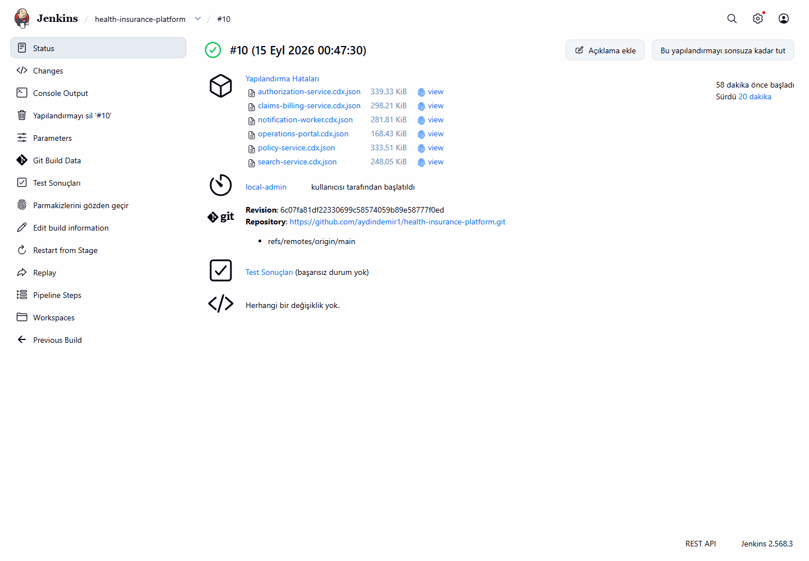

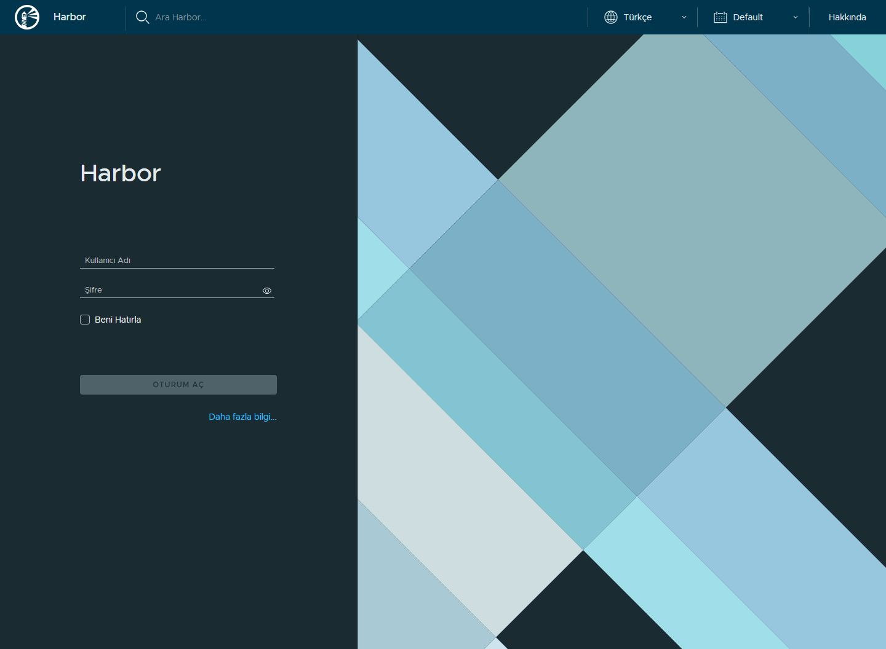

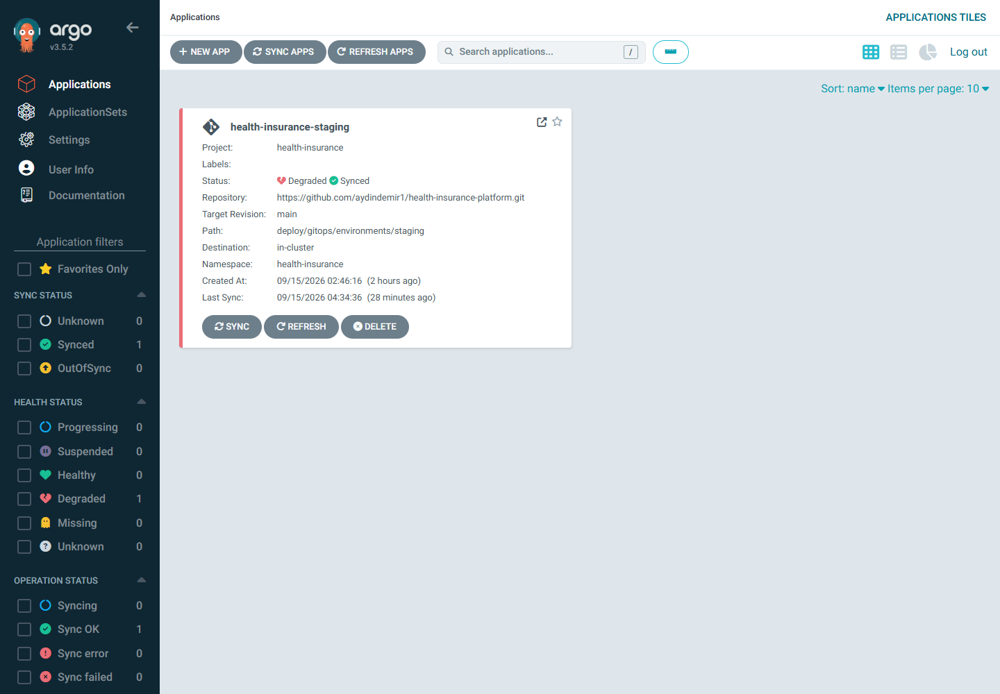

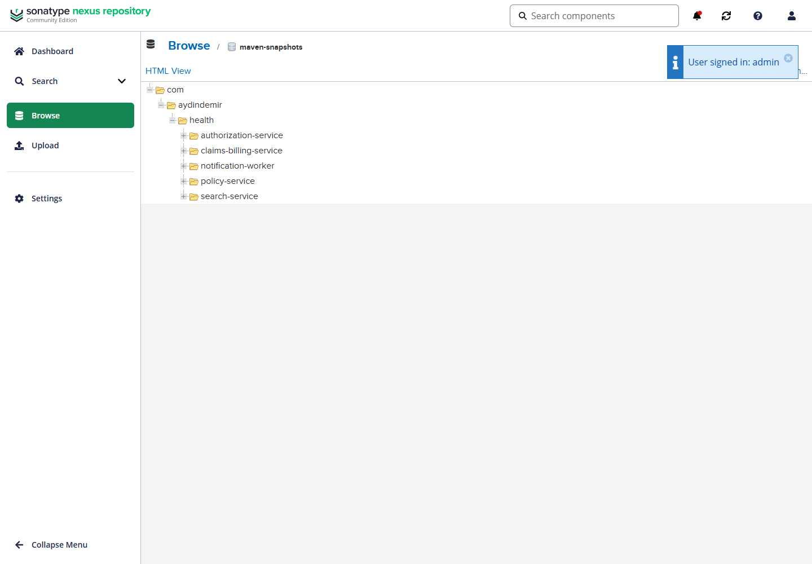

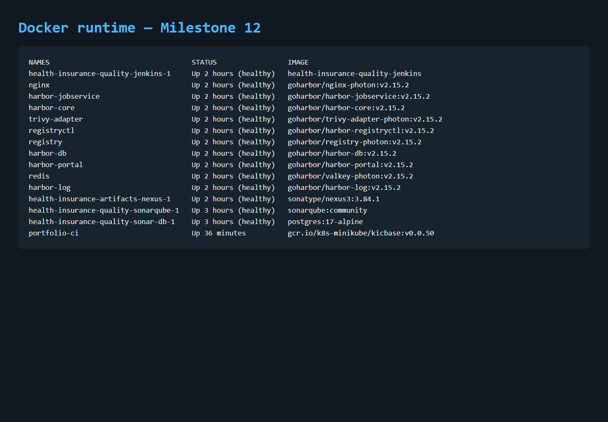

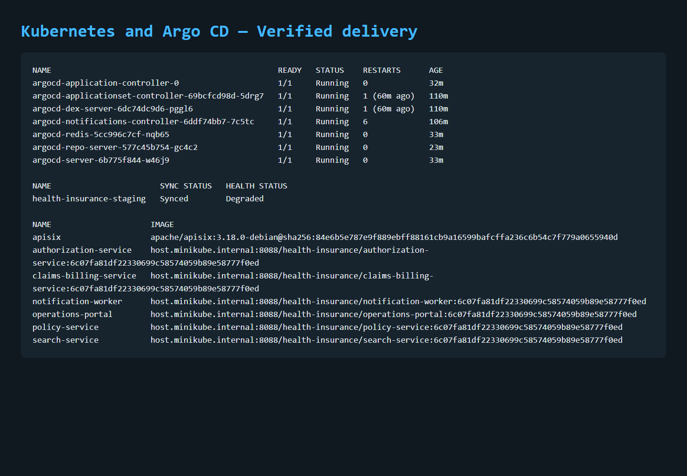

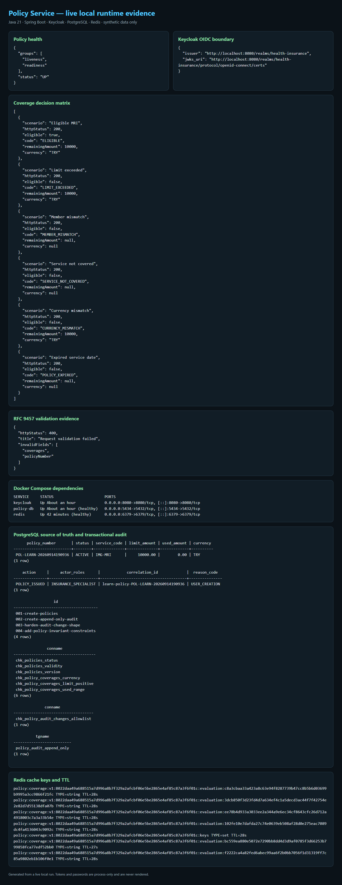

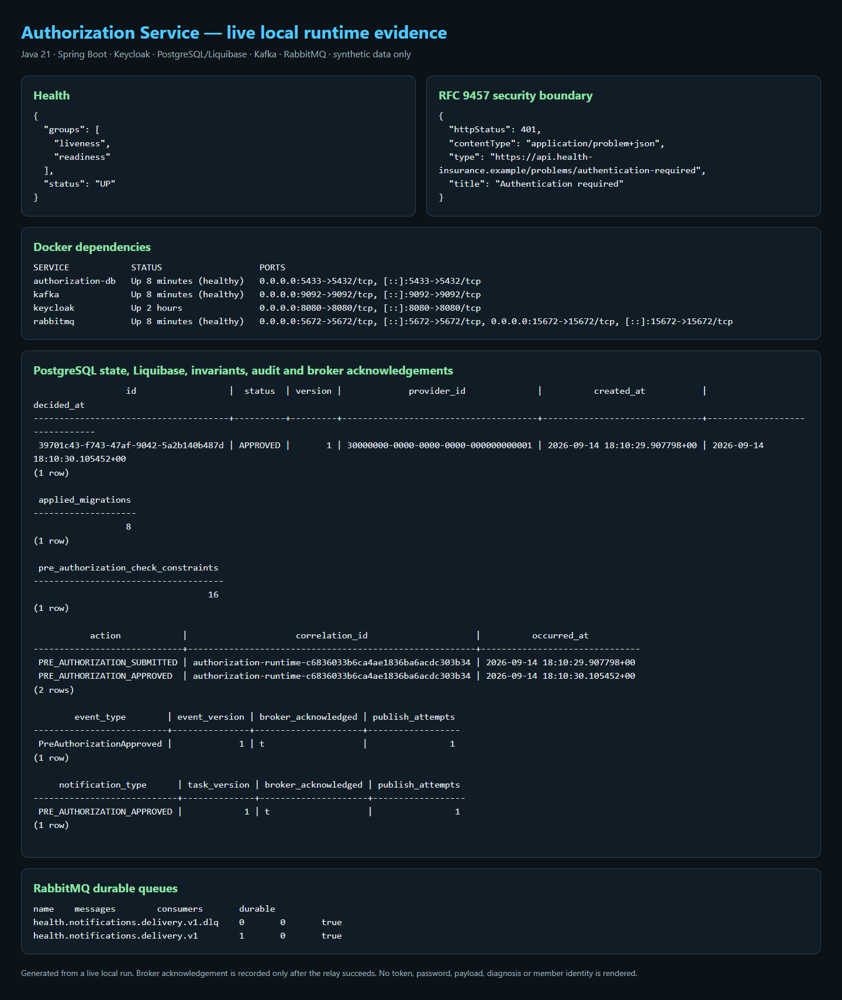

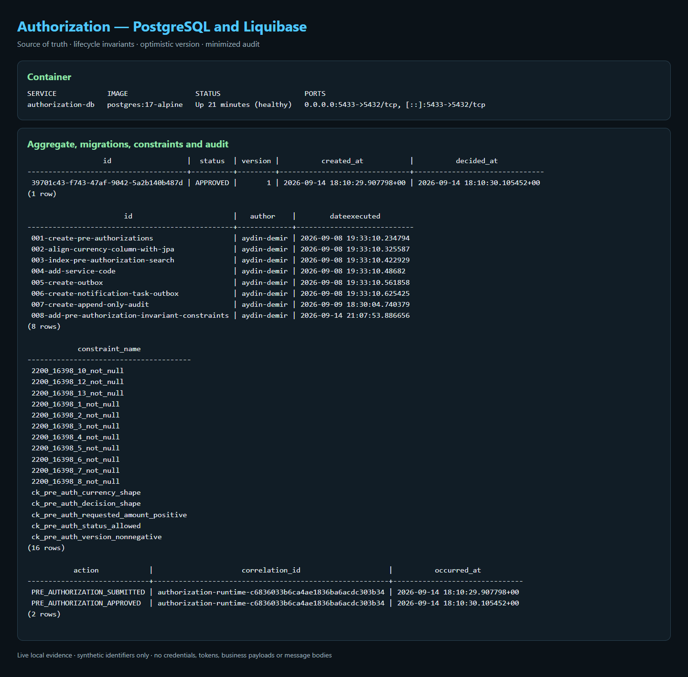

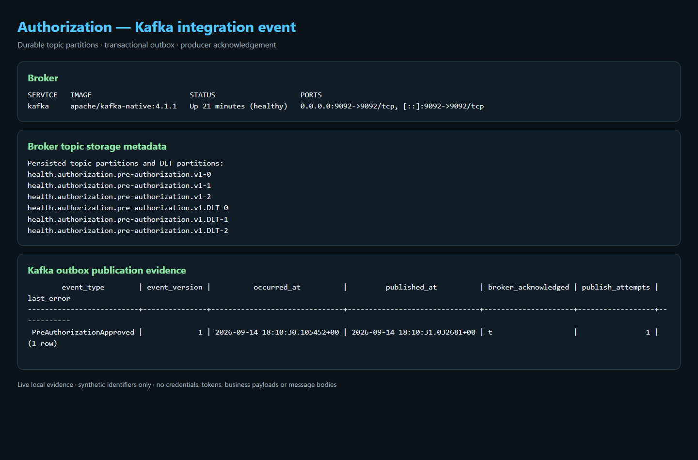

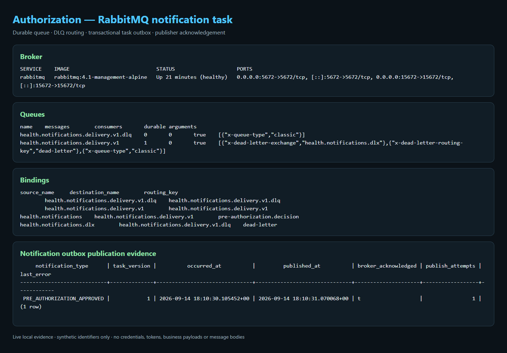

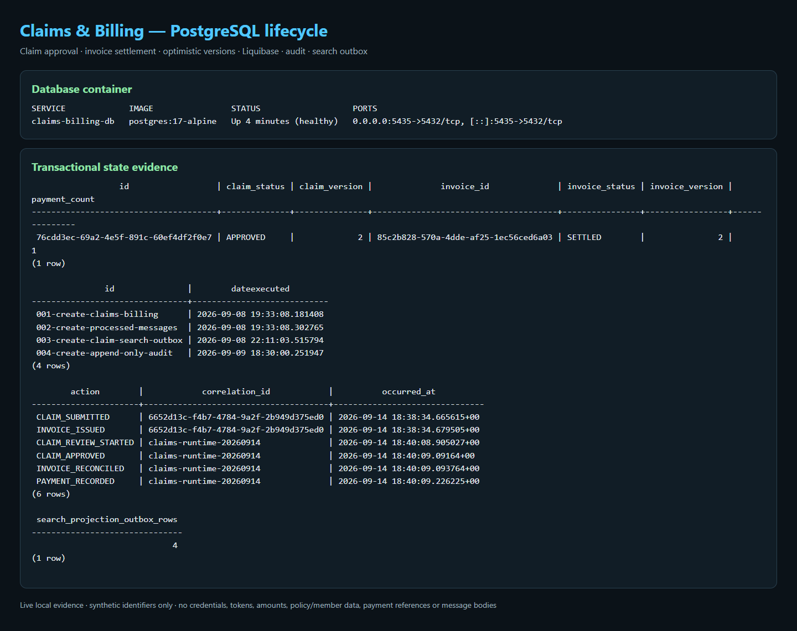

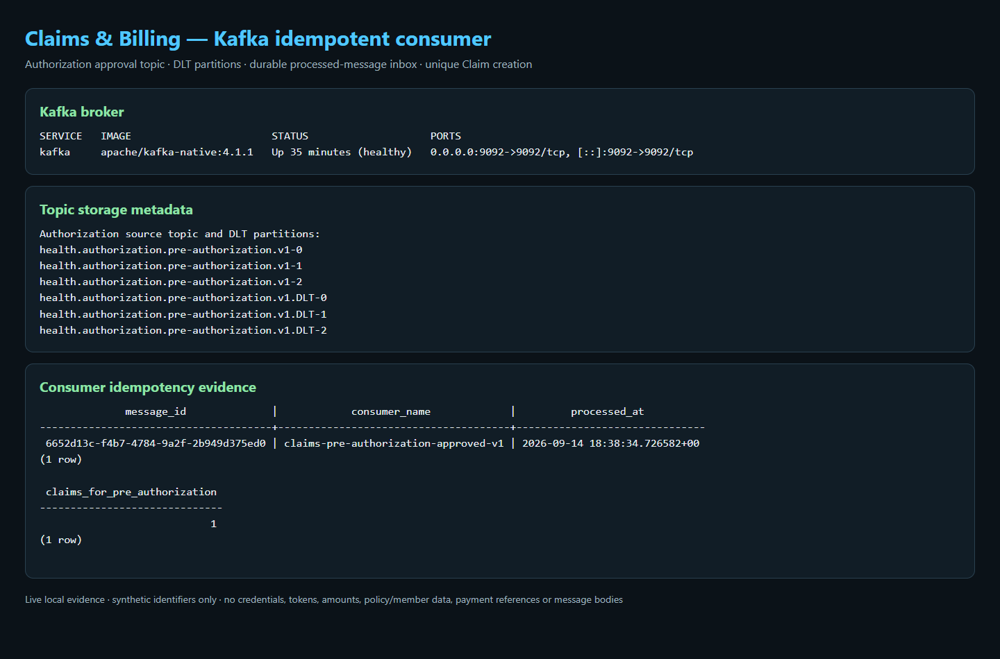

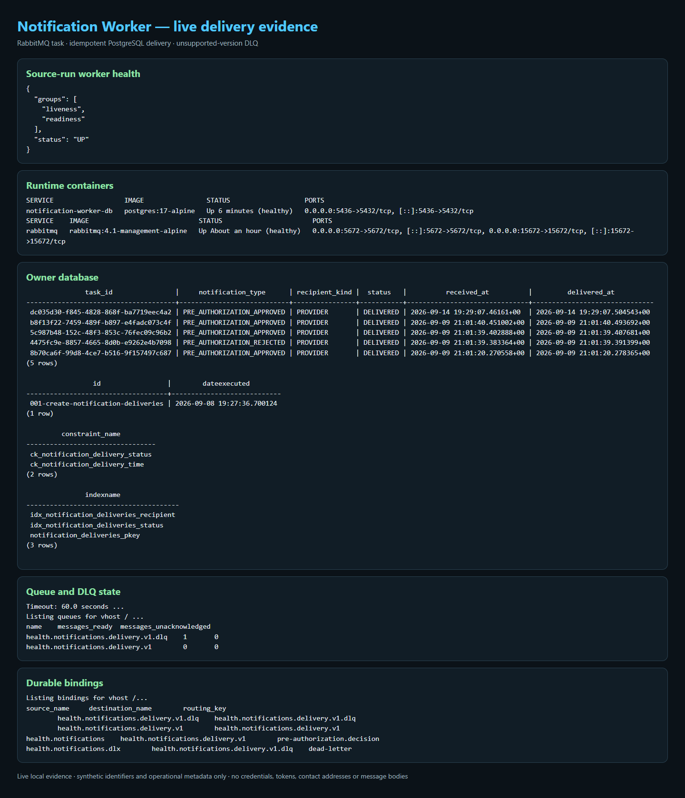

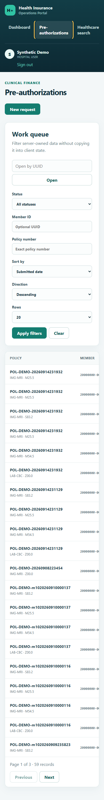


To recapture them, start the local stack and portal, seed synthetic demo data as
described in the [demo scenario](../demo/demo-scenario.md), sign in using a
runtime-only local user, and replace only images whose view changed:

```powershell
$env:DEMO_USER_PASSWORD = "<temporary-local-demo-password>"
$env:DEMO_POLICY_NUMBER = "<policy-number-reported-by-the-seed-script>"
Set-Location apps/operations-portal
npm run screenshots
```

The gateway verification deliberately drives the per-IP quota until it receives
`429`. Therefore, either wait for the one-minute quota window to reset before
capturing, or prepare a capture run with `-SkipGatewayVerification` and execute
the gateway verification separately. Otherwise the first portal collection
request can correctly receive `429` and the capture will time out.

The capture script drives real Keycloak logins and real API-backed pages,
including `system-admin-demo` for the audit view, in headless Chrome. It fills
but does not submit the example form or pending
decision, so recapturing screenshots does not mutate business data.

Milestone 7 adds the sixth portal view and an APM runtime view. Capture them only
after the synthetic demo has produced Elasticsearch documents and Java-agent
traffic; never expose tokens, credentials, or raw event payloads.

To recapture only the broker evidence, use a temporary local RabbitMQ account
with read-only/monitoring permissions, keep its values in the process
environment, and remove it after capture:

```powershell
$env:RABBITMQ_SCREENSHOT_USERNAME = "<temporary-local-monitoring-user>"
$env:RABBITMQ_SCREENSHOT_PASSWORD = "<temporary-local-password>"
Set-Location apps/operations-portal
npm run screenshots:rabbitmq
```

The script waits for both exact queue names before capturing. It does not read,
publish, acknowledge, or delete messages and never writes credentials to the
image or repository.

Capture the no-credential local Kibana APM inventory after generating traffic:

```powershell
Set-Location apps/operations-portal
npm run screenshots:kibana
```

Capture the gateway-native error contract without any credentials:

```powershell
Set-Location apps/operations-portal
npm run screenshots:gateway
```

Capture the token-free search recovery evidence only after a successful rebuild:

```powershell
Set-Location apps/operations-portal
npm run screenshots:recovery
```

The capture reads only Elasticsearch alias, index name/status, document count,
and storage-size metadata. It validates exactly one writable stable alias and a
retained `healthcare-operations-v1` predecessor before writing the PNG; it does
not query or render document payloads.

The local Compose stack disables Elastic security for developer convenience and
binds Elastic ports to loopback. That setting is not a production security model.

To recapture the Policy-only evidence, start Policy Service with its PostgreSQL,
Redis, and Keycloak dependencies, then provide a short-lived specialist token
and the synthetic policy identity only through the current process:

```powershell
$env:POLICY_SCREENSHOT_TOKEN = "<short-lived-token>"
$env:POLICY_SCREENSHOT_POLICY_NUMBER = "<synthetic-policy-number>"
$env:POLICY_SCREENSHOT_MEMBER_ID = "<synthetic-member-uuid>"
Set-Location apps/operations-portal
npm run screenshots:policy
```

The script warms the real coverage cache, queries only the matching synthetic
PostgreSQL policy/audit evidence, and renders only hashed Redis keys. It never
renders or persists the token, database password, or Keycloak administrator
credential.

To recapture the Authorization-only evidence, keep Authorization Service and
its PostgreSQL, Kafka, RabbitMQ, Keycloak and Policy dependencies running. Pass
only the synthetic request UUID; no access token is required or persisted:

```powershell
$env:AUTHORIZATION_SCREENSHOT_PRE_AUTHORIZATION_ID = "<synthetic-pre-authorization-uuid>"
Set-Location apps/operations-portal
npm run screenshots:authorization
npm run screenshots:authorization-infrastructure
```

The image renders only operational metadata and minimized audit actions. It
does not render business payloads, member/diagnosis identifiers, credentials,
tokens, or broker message bodies.

To recapture the Claims/Billing evidence after completing a synthetic claim and
invoice lifecycle:

```powershell
$env:CLAIMS_SCREENSHOT_CLAIM_ID = "<synthetic-claim-uuid>"
Set-Location apps/operations-portal
npm run screenshots:claims
```

The script reads state and idempotency metadata only. Financial amounts,
payment references, policy/member data, credentials, tokens, and Kafka payloads
are deliberately excluded.

Capture Notification Worker evidence after a synthetic task has been delivered
and an unsupported contract version has reached the DLQ:

```powershell
Set-Location apps/operations-portal
npm run screenshots:notification
```

The image contains only opaque synthetic identifiers, delivery lifecycle,
migration/constraint/index metadata, bindings, and queue counts. It never reads
or renders message bodies, credentials, tokens, or contact addresses.
