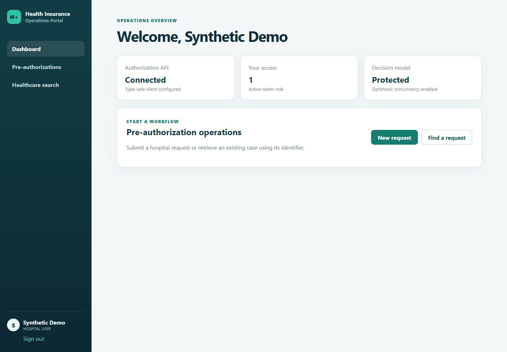
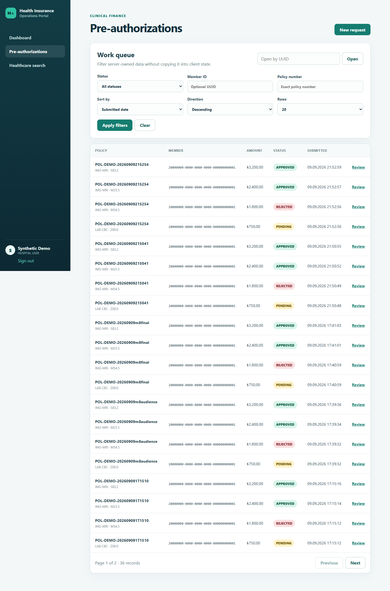
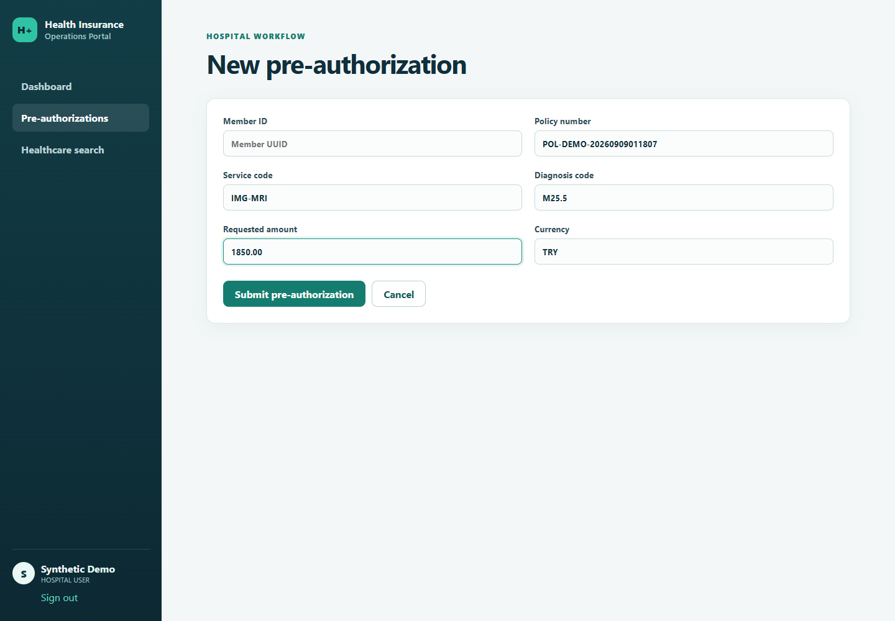
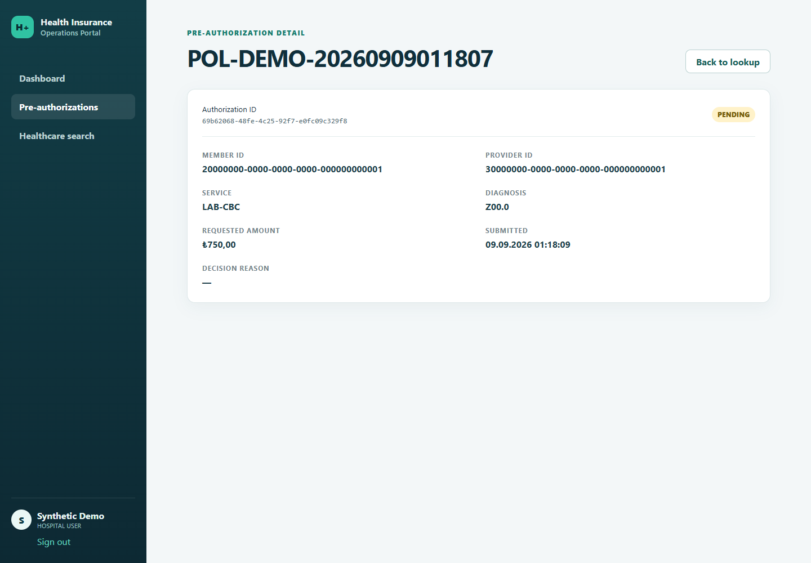
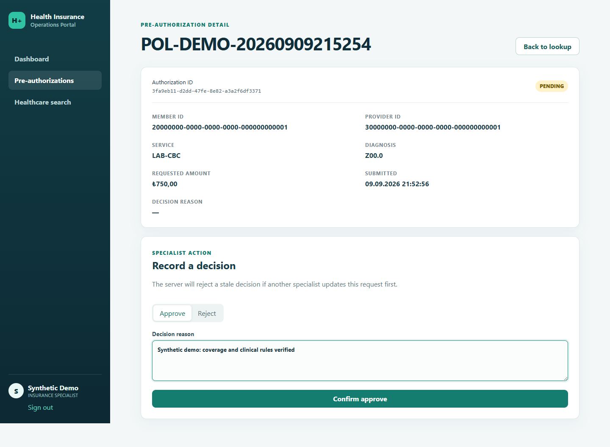

# Screenshot Catalogue

This directory contains milestone checkpoint images captured from the running
operations portal with synthetic demo identifiers. It must never contain access
tokens, credentials, real patient information, or real provider data.

The current portal only implements pre-authorization operations. Policy and
Claims/Billing are demonstrated through the API script until their screens are
implemented in a later milestone.

Screenshots retained for the Milestone 5 documentation checkpoint:

- `01-dashboard.png` — role-aware landing page and operational summary.
- `02-pre-authorization-work-queue.png` — filter, sort, and pagination UI.
- `03-submit-pre-authorization.png` — validated hospital submission form.
- `04-pre-authorization-detail.png` — request detail and status information.
- `05-specialist-decision.png` — specialist approval/rejection controls.

## Preview











To recapture them, start the local stack and portal, seed synthetic demo data as
described in the [demo scenario](../demo/demo-scenario.md), sign in using a
runtime-only local user, and replace only images whose view changed:

```powershell
$env:DEMO_USER_PASSWORD = "<temporary-local-demo-password>"
$env:DEMO_POLICY_NUMBER = "<policy-number-reported-by-the-seed-script>"
Set-Location apps/operations-portal
npm run screenshots
```

The capture script drives the real Keycloak login and real API-backed pages in
headless Chrome. It fills but does not submit the example form or pending
decision, so recapturing screenshots does not mutate business data.

Milestone 5 changes backend delivery semantics but introduces no new portal
surface, so the five images were reviewed and intentionally retained rather
than replaced with visually identical files. Kafka/outbox evidence is captured
in executable integration tests and the event-driven architecture diagrams.

The current Milestone 6 persistence/producer-relay checkpoint also has no portal
surface. Its evidence is the PostgreSQL transaction test, publisher-confirm,
listener/acknowledgement and topology tests, and messaging/component/state/ER
diagrams, so the same five UI screenshots remain current.
