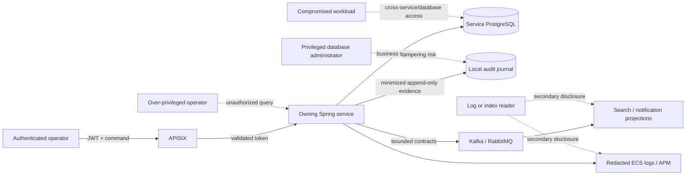

# Veri yönetişimi, gizlilik ve KVKK threat model'i

## Kapsam ve hukuki sınır

Bu belge, sentetik bir portföy sistemi için hazırlanmış bir mühendislik kontrol dokümanıdır. Hukuki danışmanlık değildir, projenin production ortamında mevzuata uyumlu olduğunu iddia etmez ve bir organizasyonun hukuki işleme şartını veya yasal saklama sürelerini belirlemez. Bu kararlar gerçek veri sorumlusu, işleme envanteri, sektörel kurallar, sözleşmeler ve hukuki inceleme gerektirir.

Tasarım aşağıdaki resmi üst seviye kısıtları esas alır:

- KVKK sağlık verisini özel nitelikli kişisel veri olarak tanımlar ve uygun işleme şartları ile güvenlik tedbirleri gerektirir. Bkz. Kişisel Verileri Koruma Kurumu'nun [özel nitelikli veri rehberi](https://www.kvkk.gov.tr/Icerik/8184/Ozel-Nitelikli-Kisisel-Verilerin-Islenmesine-Iliskin-Rehber).
- İşleme belirli bir amaca yönelik, ilgili, sınırlı ve ölçülü olmalı; veriler yalnızca mevzuatın veya işleme amacının gerektirdiği süre boyunca saklanmalıdır. Bkz. Kurum'un [kişisel verilerin işlenmesine ilişkin ilkeleri](https://www.kvkk.gov.tr/Icerik/2048/Kisisel-Verilerin-Islenmesi).
- İşleme şartları sona erdiğinde silme, yok etme veya anonim hale getirme; kontrollü bir politika ve kayıt altına alınmış uygulama gerektirir. Bkz. resmi [silme/anonimleştirme rehberi](https://www.kvkk.gov.tr/Icerik/2038/kisisel-verilerin-silinmesi-yok-edilmesi-veya-anonim-hale-getirilmesi) ve [uygulama yönetmeliği](https://www.kvkk.gov.tr/Icerik/5441/KISISEL-VERILERIN-SILINMESI-YOK-EDILMESI-VEYA-ANONIM-HALE-GETIRILMESI-HAKKINDA-YONETMELIK).

## Mevcut veri envanteri

Commit edilmiş demo value'larının tamamı sentetiktir. UUID ve kodlanmış value'lar gerçek deployment'ta tanımlanabilir bir kişiyle ilişkiliyse yine de kişisel veri olabilir; "pseudonymous" olmak "anonymous" olmak anlamına gelmez.

| Veri | Mevcut konumlar | Sınıflandırma | Audit yaklaşımı |
| --- | --- | --- | --- |
| `memberId` | Policy, Authorization, Claims, event'ler, Elasticsearch, UI | Kişisel identifier | Aggregate üzerinden dolaylı referans ver; kopyalama |
| `diagnosisCode` | Authorization database ve UI | Özel nitelikli sağlık verisi | Audit/log içine asla kopyalama |
| Service/coverage code | Policy, Authorization, Claims, search | Sağlık bilgisi çıkarımına yol açabilir | Yalnızca owning record içinde sakla; audit'ten çıkar |
| Policy number | Policy, Authorization, Claims, search | Bağlantı kurulabilir finansal/sigorta identifier'ı | Audit/log içine asla kopyalama |
| Requested/approved/paid amount'lar | Business database'ler, event'ler, search | Finansal veri | Amount yerine yalnızca transition audit et |
| Decision/rejection reason | Authorization, Claims, search | Free text; sağlık verisi içerebilir | Yalnızca owning aggregate içinde sakla; audit'te controlled reason code kullan |
| Provider ID | Token claim, business record'lar, search | Organization/actor scope | Yalnızca authorization evidence için gerektiğinde audit et |
| Keycloak subject ve role'ler | JWT ve application actor context | Identity ve access metadata | Minimized audit actor field'ları olarak gereklidir |
| Correlation/event/task ID'leri | HTTP, log'lar, message'lar, APM | Operational metadata | Kullanılabilir; identity proof olarak değerlendirilmez |
| Notification recipient reference | Worker database ve safe metadata log | Contact-routing reference | Audit'e contact content ekleme |
| Token, password, secret | Yalnızca runtime environment | Restricted secret | Asla persist etme, loglama, indexleme, screenshot'a alma veya audit etme |

Elasticsearch derived read model'dir, Redis disposable cache'tir, Kafka ve RabbitMQ bounded integration/task contract'ları içerir ve PostgreSQL database'ler service-owned system of record'lardır. Veriyi başka bir teknolojiye kopyalamak yeni bir processing surface oluşturur ve ücretsiz/risksiz kabul edilmek yerine gerekçelendirilmelidir.

## Amaç ve minimization matrisi

| Surface | İzin verilen amaç | Yasak örnekler |
| --- | --- | --- |
| Business PostgreSQL | Owning aggregate'in workflow'unu yürütmek | Cross-service direct read |
| Audit journal | Actor, action, time, authorization context ve state delta kanıtı | Full entity snapshot, diagnosis, free text, request body |
| Application log | ID, status code ve timing ile operability | Member/policy/diagnosis/contact/token value'ları |
| Elasticsearch | Authorized operations search | Source of truth veya unlimited archive haline gelmek |
| Redis | Short-lived coverage evaluation acceleration | Authoritative policy storage veya indefinite retention |
| Kafka | Durable bounded integration fact'ler | Gereksiz clinical detail veya secret |
| RabbitMQ | Notification work distribution | Rendered clinical content veya credential |
| APM | Performance/error diagnosis | Request body, JWT, sensitive label |
| Screenshot/demo | Sentetik record'larla portfolio proof | Gerçek patient, employee, provider veya credential data |

## Threat model

| Tehdit | Gerekli kontrol | Mevcut durum / evidence |
| --- | --- | --- |
| Provider başka provider'ın record'unu okur | Trusted `provider_id` scope + use-case authorization | Uygulandı ve test edildi |
| Yetkisiz audit browsing | `SYSTEM_ADMIN` endpoint ve use-case check'leri, pagination ve bounded filter'lar | Authorization, Policy ve Claims/Billing içinde bağımsız olarak uygulandı |
| Sensitive content audit'e kopyalanır | Typed audit contract ve allowlist edilmiş change key'leri | Üç owning service'te uygulandı; contract'larda member, policy, diagnosis, amount veya free-text field yok |
| Audit olmadan business mutation | Aynı local transaction, fail-closed persistence | Authorization submission/decision, Policy issuance ve Claims/Billing claim/invoice/payment transition'larında uygulandı |
| Audit row değiştirilir veya silinir | Insert-only port, database protection, integration test'leri | Her owning PostgreSQL database içinde uygulandı |
| JWT/secret log'larda görünür | Body/header logging yok; automated forbidden-field assertion'ları | Body/header logging yok ve safe structured metadata kullanılıyor; kapsamlı negative log-capture test'leri hâlâ açık |
| Search/log/message kontrolsüz archive haline gelir | Retention class, rebuild ve controlled replay runbook'ları, bounded access | M10 non-destructive search rebuild ve digest-only dead-letter inspection uygular; disposal M15'e kalır |
| Correlation ID identity sanılır | Actor subject ayrı saklanır; correlation yalnızca diagnostic olarak dokümante edilir | Audit contract tarafından enforce edilir |
| Privileged database tampering | External immutable backup/signature/WORM control | Mevcut local scope dışında; explicit residual risk |

## Retention policy modeli

Bu belge herhangi bir duration'ı hard-code etmez. Record'lar configurable policy key alır; deployment her key'i hukuken onaylanmış bir amaç, maximum period, trigger, disposal method, owner ve evidence requirement ile eşlemelidir.

| Policy key | Amaçlanan kategori | Disposal yönü |
| --- | --- | --- |
| `TRANSIENT_SECRET` | Token ve ephemeral credential | Persist etme; mümkün olduğunda memory/output'tan hemen kaldır |
| `OPERATIONAL_DIAGNOSTIC` | Log, trace ve short-lived technical metadata | Restricted access ile kısa ve configurable rotation |
| `BUSINESS_RECORD` | Policy, authorization, claim, invoice ve payment truth | Silme veya anonimleştirme öncesi legal/business review |
| `AUDIT_EVIDENCE` | Minimized append-only accountability record'ları | Bağımsız onaylanmış retention ve controlled disposal evidence |
| `DERIVED_REBUILDABLE` | Redis ve Elasticsearch projection'ları | Amaç sona erdiğinde source record'lardan önce sil/rebuild et |
| `DEMO_SYNTHETIC` | Repository demo kataloğu ve screenshot'lar | Yalnızca sentetik oldukları kanıtlanabildiği sürece portfolio asset olarak tut |

Gelecekteki retention job; dry-run capable, idempotent, observable ve authorized olmalıdır. Silme/anonimleştirme işlemini, silinen kişisel veriyi evidence içine yeniden sokmadan kaydetmelidir. Backup ve derived store'lar aynı disposal analysis'in parçasıdır.

## Audit access boundary

Audit evidence, business transaction'ın sahibi olan service tarafından sahiplenilmeye devam eder. Shared audit database yoktur ve hiçbir service başka service'in schema'sını okumaz.

| API | Kapsam | Filter'lar | Sıralama |
| --- | --- | --- | --- |
| Authorization `GET /api/v1/audit-records` | Authorization submission ve decision'ları | `aggregateId`, allowlist edilmiş `action`, page, size | `occurredAt DESC`, ardından `auditId DESC` |
| Policy `GET /api/v1/policies/audit-records` | Policy issuance | `aggregateId`, allowlist edilmiş `action`, page, size | `occurredAt DESC`, ardından `auditId DESC` |
| Claims/Billing `GET /api/v1/claims/audit-records` | Claim, invoice, reconciliation ve payment transition'ları | `aggregateId`, allowlist edilmiş `action`, page, size | `occurredAt DESC`, ardından `auditId DESC` |

Üç path'in tamamı hem presentation hem application boundary'de `SYSTEM_ADMIN` gerektirir, page başına en fazla 100 record döndürür ve yalnızca minimized audit contract'ı sunar. APISIX bu API'leri route eder ancak service authorization'ın yerine geçmez. Portal tek seferde bir service'i açıkça seçer; bu nedenle convenient unified screen database ownership'i zayıflatmaz veya globally atomic timeline varmış gibi davranmaz. Audit read'ler aynı journal'a recursive biçimde yazılmaz; production audit-read access monitoring ayrı korunan security/SIEM trail içinde ele alınmalıdır.

## Mühendislik checklist'i

- [x] Repository demo record'ları açıkça sentetiktir ve secret'lar runtime-only'dir.
- [x] Provider ownership request body'den değil trusted token claim'inden türetilir.
- [x] Gateway ve service'ler unauthenticated access'i reddeder.
- [x] Log'lar message body yerine structured operational identifier kullanır.
- [x] Yönetilen Authorization, Policy ve Claims/Billing mutation'ları local transaction içinde audit evidence append eder.
- [x] Üç audit store'un tamamı update, delete ve truncate operation'larını reddeder.
- [x] Tüm audit read use case'leri `SYSTEM_ADMIN` gerektirir ve bounded pagination/filtering kullanır.
- [x] Audit payload key'leri allowlist'tedir ve typed contract'lar sensitive business field'ları dışlar.
- [ ] Log-capture test'leri token, member, policy, diagnosis ve contact value'larını reddeder.
- [ ] Retention mapping'leri codebase dışında legal/data-controller onayı alır.
- [ ] Disposal job'ları ve backup handling için production data-governance program gereklidir.

## Residual risk'ler

- Local environment gerçek bir hospital veya insurer'ın lawful basis'ini, consent yükümlülüklerini, data-controller/processor rollerini veya sektörel retention hukukunu modellemez.
- Local Docker volume'ları ve developer access production segregation değildir.
- Database encryption, key rotation, immutable backup, SIEM alert'leri ve privileged access management henüz uygulanmamıştır.
- Retention duration'larının legal/data-controller onayı ve executable, rehearsal yapılmış disposal process Milestone 9 dışında kalır.
- Search ve event payload'ları linkable operational field'lar içerir. M10 recovery mevcut minimized contract'ları korur, broker inspection sırasında payload'ları gizler ve source database'leri asla kopyalamaz; lifecycle disposal hâlâ açıktır.
- UI screenshot'ları yalnızca demo kataloğu sentetik olduğu için güvenlidir; publication öncesinde visual review zorunlu kalır.
