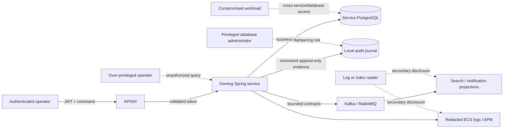

# Data governance, privacy, and KVKK threat model

## Scope and legal boundary

This is an engineering control document for a synthetic portfolio system. It is
not legal advice, does not assert that the project is production-compliant, and
does not choose an organization's lawful basis or statutory retention periods.
Those decisions require the real data controller, processing inventory, sector
rules, contracts, and legal review.

The design follows these official high-level constraints:

- KVKK identifies health data as special category personal data and requires
  appropriate processing conditions and safeguards. See the Turkish Personal
  Data Protection Authority's [special-category data guide](https://www.kvkk.gov.tr/Icerik/8184/Ozel-Nitelikli-Kisisel-Verilerin-Islenmesine-Iliskin-Rehber).
- Processing should be purpose-specific, relevant, limited, proportionate, and
  retained only as long as legislation or the purpose requires. See the
  Authority's [processing principles](https://www.kvkk.gov.tr/Icerik/2048/Kisisel-Verilerin-Islenmesi).
- When processing grounds end, erasure, destruction, or anonymization requires a
  controlled policy and recorded execution. See the official
  [erasure/anonymization guidance](https://www.kvkk.gov.tr/Icerik/2038/kisisel-verilerin-silinmesi-yok-edilmesi-veya-anonim-hale-getirilmesi)
  and [implementing regulation](https://www.kvkk.gov.tr/Icerik/5441/KISISEL-VERILERIN-SILINMESI-YOK-EDILMESI-VEYA-ANONIM-HALE-GETIRILMESI-HAKKINDA-YONETMELIK).

## Current data inventory

All committed demo values are synthetic. UUIDs and coded values can still be
personal data in a real deployment when they relate to an identifiable person;
"pseudonymous" does not mean "anonymous."

| Data | Current locations | Classification | Audit treatment |
| --- | --- | --- | --- |
| `memberId` | Policy, Authorization, Claims, events, Elasticsearch, UI | Personal identifier | Reference indirectly by aggregate; do not copy |
| `diagnosisCode` | Authorization database and UI | Special category health data | Never copy into audit/logs |
| Service/coverage code | Policy, Authorization, Claims, search | Potential health inference | Store only in owning record; omit from audit |
| Policy number | Policy, Authorization, Claims, search | Linkable financial/insurance identifier | Never copy into audit/logs |
| Requested/approved/paid amounts | Business databases, events, search | Financial data | Audit transition only, not amount |
| Decision/rejection reason | Authorization, Claims, search | Free text; may contain health data | Store in owning aggregate only; audit controlled reason code |
| Provider ID | Token claim, business records, search | Organization/actor scope | Audit only when needed for authorization evidence |
| Keycloak subject and roles | JWT and application actor context | Identity and access metadata | Required minimized audit actor fields |
| Correlation/event/task IDs | HTTP, logs, messages, APM | Operational metadata | Allowed; never treated as identity proof |
| Notification recipient reference | Worker database and safe metadata log | Contact-routing reference | Do not add contact content to audit |
| Tokens, passwords, secrets | Runtime environment only | Restricted secret | Never persist, log, index, screenshot, or audit |

Elasticsearch is a derived read model, Redis is a disposable cache, Kafka and
RabbitMQ contain bounded integration/task contracts, and PostgreSQL databases
are service-owned systems of record. Copying data into another technology is a
new processing surface and must be justified rather than treated as free.

## Purpose and minimization matrix

| Surface | Allowed purpose | Forbidden examples |
| --- | --- | --- |
| Business PostgreSQL | Execute the owning aggregate's workflow | Cross-service direct reads |
| Audit journal | Evidence of actor, action, time, authorization context and state delta | Full entity snapshots, diagnosis, free text, request bodies |
| Application log | Operability using IDs, status codes and timings | Member/policy/diagnosis/contact/token values |
| Elasticsearch | Authorized operations search | Becoming the source of truth or an unlimited archive |
| Redis | Short-lived coverage evaluation acceleration | Authoritative policy storage or indefinite retention |
| Kafka | Durable bounded integration facts | Unnecessary clinical detail or secrets |
| RabbitMQ | Notification work distribution | Rendered clinical content or credentials |
| APM | Performance/error diagnosis | Request bodies, JWTs, sensitive labels |
| Screenshots/demo | Portfolio proof using synthetic records | Real patient, employee, provider, or credential data |

## Threat model

| Threat | Required control | Current state / planned Milestone 9 evidence |
| --- | --- | --- |
| Provider reads another provider's record | Trusted `provider_id` scope plus use-case authorization | Implemented and tested |
| Unauthorized audit browsing | `SYSTEM_ADMIN` endpoint and use-case checks, pagination and bounded filters | Planned |
| Sensitive content copied into audit | Typed audit contract and allowlisted change keys | Planned |
| Business mutation without audit | Same local transaction, fail-closed persistence | Planned |
| Audit row changed or deleted | Insert-only port, database protection, integration tests | Planned |
| JWT/secret appears in logs | No body/header logging; automated forbidden-field assertions | Partly implemented; tests expanded in M9 |
| Search/log/message becomes an uncontrolled archive | Retention class, rebuild/delete runbooks and access controls | Design now; operations continue in M10/M15 |
| Correlation ID mistaken for identity | Store actor subject separately; document correlation as diagnostic only | Design enforced by audit contract |
| Privileged database tampering | External immutable backup/signature/WORM control | Out of current local scope; explicit residual risk |

## Retention policy model

No duration is hard-coded by this document. Records receive a configurable
policy key, and the deployment must map each key to a legally approved purpose,
maximum period, trigger, disposal method, owner, and evidence requirement.

| Policy key | Intended category | Disposal direction |
| --- | --- | --- |
| `TRANSIENT_SECRET` | Tokens and ephemeral credentials | Never persist; remove immediately from memory/output where practical |
| `OPERATIONAL_DIAGNOSTIC` | Logs, traces and short-lived technical metadata | Short, configurable rotation with restricted access |
| `BUSINESS_RECORD` | Policy, authorization, claim, invoice and payment truth | Legal/business review before deletion or anonymization |
| `AUDIT_EVIDENCE` | Minimized append-only accountability records | Independently approved retention and controlled disposal evidence |
| `DERIVED_REBUILDABLE` | Redis and Elasticsearch projections | Delete/rebuild before source records when purpose expires |
| `DEMO_SYNTHETIC` | Repository demo catalogue and screenshots | Retain as portfolio assets only while demonstrably synthetic |

The future retention job must be dry-run capable, idempotent, observable, and
authorized. It must record erasure/anonymization execution without reintroducing
the erased personal data into its evidence. Backups and derived stores are part
of the same disposal analysis.

## Engineering checklist

- [x] Repository demo records are explicitly synthetic and secrets are runtime-only.
- [x] Provider ownership is derived from a trusted token claim, not a request body.
- [x] Gateway and services reject unauthenticated access.
- [x] Logs use structured operational identifiers instead of message bodies.
- [ ] State mutations and audit inserts are one transaction.
- [ ] Audit storage rejects update and delete operations.
- [ ] Audit read use cases require `SYSTEM_ADMIN`.
- [ ] Audit payload keys are allowlisted and sensitive fields have negative tests.
- [ ] Log-capture tests reject token, member, policy, diagnosis and contact values.
- [ ] Retention mappings receive legal/data-controller approval outside the codebase.
- [ ] Disposal jobs and backup handling are implemented and rehearsed in Milestone 15.

## Residual risks

- The local environment does not model a real hospital or insurer's lawful basis,
  consent obligations, data-controller/processor roles, or sector retention law.
- Local Docker volumes and developer access are not production segregation.
- Database encryption, key rotation, immutable backup, SIEM alerts, and privileged
  access management are not yet implemented.
- Search and event payloads currently contain linkable operational fields; M10
  must add recovery and lifecycle controls without increasing their data scope.
- UI screenshots are safe only because the demo catalogue is synthetic; visual
  review remains mandatory before publication.

